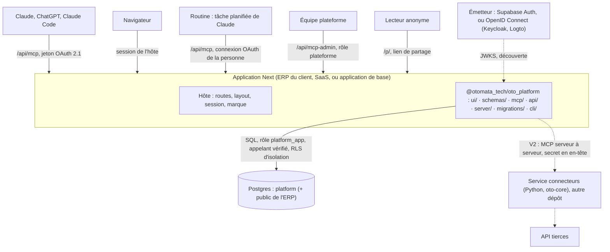
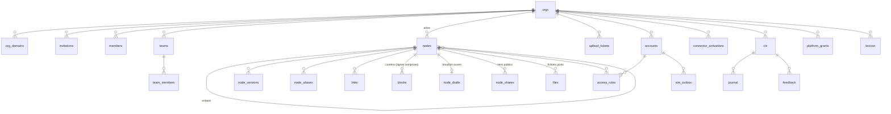

# Architecture technique — `@otomata_tech/oto_platform`

> Document technique unique : le paquet et ses faces, le modèle de données, les services et leurs
> portes, l'identité, l'installation d'un hôte, les invariants. Le fonctionnel (vision, parcours,
> exigences et leur état) est dans [`docs/prd.md`](prd.md). Les décisions sont dans
> `docs/decisions/` : ADR-001 à ADR-020 ; `hypotheses.md` et `fiche-decisions.md` résolvent les
> identifiants de choix encore cités par le code (H…, P…, D…, hypothèses de story). Ce document dit
> où chaque chose vit ; les ADR disent pourquoi.

## 1. Vue d'ensemble



| De | Vers | Par |
|----|------|-----|
| Utilisateur | Écrans de l'hôte et du paquet | Navigateur, session de l'hôte (Supabase, ou cookie chiffré en mode OIDC) |
| Claude, ChatGPT, Claude Code | Les six outils | `https://<adresse>/api/mcp`, jeton OAuth de l'utilisateur |
| Équipe plateforme | Huit outils admin | `https://<adresse>/api/mcp-admin`, jeton OAuth, rôle plateforme |
| Page de l'hôte (Server Component) | Services du paquet | Import de `@otomata_tech/oto_platform/server`, appelant de la session |
| Écran du paquet (mutation) | API du paquet | `/api/platform/<ressource>`, même origine |
| Lecteur anonyme | Page publique d'un lien de partage | `/p/<jeton>`, sans session (ADR-013) |
| Services du paquet | Schéma `platform` | SQL au nom de l'appelant vérifié, sous RLS d'isolation (ADR-012 § 1) |
| Services du paquet, navigateur | Stockage d'objets compatible S3 (fichiers joints) | Troisième port (ADR-016) : URL présignées, clés d'accès S3 de l'hôte ; sans elles, fichiers désactivés |
| Claude Code (`curl`) | Dépôt d'un fichier | `POST /api/platform/uploads/<jeton>`, sans session : ticket à usage unique d'`upload.link` (ADR-018) |
| Services du paquet | API des tiers (CRM, mail, ERP) | V2 : connecteurs TypeScript du paquet, secret du compte lu dans le coffre (ADR-019) |

**Trois cas de client, un seul code.**

|  | Sans ERP | ERP construit par nous | ERP existant |
|---|---|---|---|
| Application | Notre application de base (le SaaS) | L'ERP : le paquet et les modules métier | Notre application de base ; l'ERP reste à part |
| Hébergement | Cellule partagée, plusieurs clients | Cellule dédiée : le déploiement de l'ERP | Cellule partagée, ou dédiée sur exigence |
| Base | Une base partagée, isolée par organisation | La base de l'ERP : `public` pour l'ERP, `platform` pour le paquet | Comme sans ERP |
| Adresse MCP | `<org>.<domaine de base>/api/mcp`, ou un domaine du client | `app.<client>/api/mcp` | Comme sans ERP |
| Fonctions métier | Les connecteurs du catalogue | Les fonctions de l'ERP, inscrites au catalogue | L'ERP comme connecteur (V2) |
| Interface | Les écrans du paquet | Les écrans de l'ERP et du paquet, une seule coque | Les écrans du paquet |

Un hôte qui n'est pas une application Next (un backend Python par exemple) n'importe pas le
paquet : il prend une application Next dédiée à côté, et l'ERP devient un connecteur. Passer
d'une cellule partagée à la base d'un ERP : export-import d'une organisation (§ 7).

**Une seule couche de fonctions sous trois portes** : le MCP, l'API et les écrans sont des
adaptateurs minces sur `server/`. Ils partagent les mêmes schémas Zod (`schemas/`), les mêmes
erreurs nommées (`PlatformError`) et le même journal.

## 2. Stack technique

Versions exactes et règles de montée : `.method/conventions/tech-stack.md`.

| Techno | Version | Rôle |
|--------|---------|------|
| Next.js | 15 (App Router) | Application hôte ; routes qui montent les faces du paquet |
| React | 19 | Écrans du paquet (`ui/`) |
| TypeScript | ~5.8.3 (strict) | Tout le code ; le paquet est publié en sources |
| Tailwind CSS | 4.x | Styling ; `@source` vers `ui/` du paquet ; jeu de tokens d'Oto sous `CoquilleOto` (ADR-008) |
| Zod | 3.25.x (`zod/v4` pour `toJSONSchema`) | Schémas partagés : écrans, API, outils MCP |
| Postgres | 16, avec `pg_trgm`, `unaccent`, `ltree` (schéma `extensions`) | Seule base ; Supabase ou Postgres nu (ADR-012) |
| `postgres` (postgres.js) | 3.4.9 exacte | Pilote du serveur, de la CLI, de l'outillage et des tests |
| `@modelcontextprotocol/sdk`, `mcp-handler`, `jose` | 1.26.0, 1.1.0, 6.2.12 exactes | Serveur MCP sur route handler, vérification des jetons |
| `nodemailer` | 10.0.10 exacte | Invitations envoyées par la plateforme en mode OIDC |
| `@supabase/supabase-js`, `@supabase/ssr` | 2.x, 0.x | Hôte en mode Supabase : session web, lien magique, consentement OAuth |
| `oauth4webapi` | 3.8.8 exacte | Hôte en mode OIDC : connexion web chez l'émetteur |
| `@phosphor-icons/react` | 2.x | Icônes des écrans du paquet |
| pnpm | 12.x (workspace) | Application de base + `packages/plateforme` |
| Vitest, Testing Library, Playwright | — | Tests unitaires, d'intégration, de bout en bout |
| Renovate, npmjs.com (public) | — | Mises à jour des applications hôtes (ADR-006, ADR-010) |

## 3. Structure

```
.
├── src/                                        # Application de base : l'hôte de référence
│   ├── app/(dashboard)/                        # Layout authentifié : organisation par l'adresse, `CoquilleOto` au thème de l'organisation, le rail
│   │   ├── page.tsx                            # Accueil
│   │   ├── n/[...chemin]/page.tsx              # Tout nœud de l'arbre : page, procédure, Contexte, tableau
│   │   ├── teams/, journal/, connect/          # Équipes et droits ; journal ; brancher un assistant
│   │   ├── upload/[token]/page.tsx             # Formulaire de dépôt d'un assistant sans shell (`form_url`, ADR-018 § 8)
│   │   └── admin/…                             # Tableau de bord : `organization/` (marque comprise), `connectors/`, `usage/`, `feedback/`
│   ├── app/(auth)/, app/auth/callback, app/auth/confirm     # Mode Supabase : connexion, lien magique, réinitialisation, invitation acceptée au retour
│   ├── app/auth/oidc/{login,callback,logout}   # Mode OIDC : connexion chez l'émetteur, session en cookie chiffré
│   ├── app/oauth/consent/page.tsx              # Mode Supabase : consentement OAuth des assistants
│   ├── app/no-organization/page.tsx            # Personne connectée sans appartenance à l'organisation de l'adresse
│   ├── app/p/…                                 # Page publique d'un lien de partage (ADR-013) ; `p/[jeton]/share-image/[[...chemin]]` : son image de partage (E11-S21)
│   ├── app/opengraph-image.tsx                 # Image de partage de toute autre adresse : l'organisation seule, jamais une page (E11-S21)
│   ├── app/api/mcp/route.ts                    # MCP des organisations
│   ├── app/api/mcp-admin/route.ts              # MCP admin, rôle plateforme
│   ├── app/api/platform/[...route]/route.ts    # API du paquet
│   ├── app/.well-known/oauth-protected-resource/[[...chemin]]/route.ts  # RFC 9728 : racine et formes suffixées
│   ├── lib/fonctions-metier.ts                 # Fonctions de l'ERP inscrites au catalogue, importé en tête des routes MCP et API
│   ├── lib/plateforme/                         # Session de l'hôte dans les deux modes, client et session OIDC, marque de l'adresse
│   ├── lib/cellule/sous-domaines.ts            # Propre au SaaS : sous-domaines par l'API Vercel, désactivé sans ses variables
│   └── middleware.ts                           # Session ; `/api`, `/.well-known`, `/p`, `/opengraph-image` publics (le MCP gère son auth)
├── packages/plateforme/                        # @otomata_tech/oto_platform
│   ├── ui/                                     # Écrans copiés d'oto-frontend et leur design system ; JAMAIS server/, migrations/ ni client de base
│   ├── schemas/                                # Zod partagé par toutes les faces, ui/ compris ; rendu des blocs, syntaxe des liens
│   ├── mcp/                                    # Six outils, MCP admin, résultats, vérification des jetons, métadonnées de ressource
│   ├── api/                                    # Handler de /api/platform/* : adaptateurs des services
│   ├── server/                                 # Services : la seule porte d'écriture dans platform
│   ├── migrations/                             # Ligne de base du schéma platform et migrations additives suivantes
│   ├── cli/                                    # `oto-platform` : `db prepare`, `migrations sync`, `migrations check`
│   └── CHANGELOG.md                            # Notes de version (format testé)
├── supabase/                                   # Projet Supabase de l'hôte : configuration, copies des migrations du paquet
├── renovate/preset.json                        # Preset Renovate des applications hôtes
├── scripts/                                    # Outillage de tout hôte (§ 7) et contrôles du dépôt
└── tests/                                      # unit, integration (dont la suite portable), e2e
```

Dépendances entre faces :
- `ui/` → `schemas/` seulement ; il reçoit ses données par props et appelle `api/` par HTTP ;
- `api/` et `mcp/` → `server/` et `schemas/` ;
- `server/` → la base, et en V2 les API des tiers (`server/connectors/`) ; `server/` n'importe ni `mcp/` ni `api/` :
  ce qu'ils partagent vit dans `schemas/` ou `server/` ;
- `migrations/` n'est importé par personne.

La frontière de `ui/` est appliquée par ESLint, avec un test. `src/` est l'hôte de référence : ce
qu'un ERP ou le SaaS écrit pour monter le paquet, rien de plus ; un appel à un service propre au
SaaS (Vercel, DNS, facturation) n'y entre que désactivé par une variable.

## 4. Modèle de données

Tout vit dans le schéma `platform`, avec `org_id` sauf exception notée. Une personne est un
identifiant interne (`uuid`, sans clé vers un annuaire), que `identities` traduit du sujet de
l'émetteur ; son email et son nom sont des copies dans `members` et `platform_staff`. Le contenu
suit ADR-011 : des nœuds typés faits de blocs, dans une seule table ; une ligne de tableau est un
bloc `row`. Les nouveautés servies par `context` se calculent (versions publiées, activations) :
elles n'ont pas de table. Il n'y a pas d'équipe « Tout le monde » : l'organisation entière est un
sujet de règle (ADR-014).



### Tables

| Table | Rôle | Colonnes |
|-------|------|----------|
| `orgs` | Un client | `slug`, `name`, `prefix` (immuable), `brand` `{theme, logo_url, display_name, language?}` (`theme` : un des huit thèmes d'Oto, couleur de tout compte sans choix ; `language` : langue de réponse par défaut), `settings` `{domains, routing: {threshold, gap}, demo}` — `domains` : les domaines de travail cités par la description de `context` (chaîne libre en anglais), `demo` : organisation de démonstration, seule que le script Démo resème —, `flags`, `rules_version` |
| `org_domains` | Adresse → organisation | `host` (clé, minuscules, sans port), `org_id` ; rattachée par l'équipe plateforme seule |
| `invitations` | Invitation en attente | `email` (minuscules), `role` (`admin` · `member`), `team_id`, `invited_by`, `expires_at` (7 jours), `accepted_at`, `accepted_by`, `declined_at`, `revoked_at` |
| `members` | Une personne dans l'organisation | `user_id`, `role` (`admin` · `member`), `default_team_id`, `profile` `{name, first_name, last_name, handle, language, theme}` (`handle` unique dans l'organisation ; `name` recomposé du prénom et du nom par `update_my_profile`) ; `email`, `name`, `last_sign_in_at` : copies posées à chaque connexion ; un membre nouveau reçoit son espace `private/<handle>`, titré « Privé » |
| `teams`, `team_members` | Équipes et appartenance | `slug` (ni `guide`, ni `perso`, ni `private`, ni `contexte`, ni `journal` ; ni `functions`, refusé par le service seul), `name`, `lead_user_id` ; `team_members.role` (`lead` · `member`), dérivé du responsable |
| `nodes` | Page, procédure, Contexte ou tableau (métadonnées ; le contenu est dans `blocks`) | `parent_id` (racine : null), `path` (unique par organisation ; suit le titre, segment de 60 caractères au plus coupé au dernier mot entier, l'ancien reste un alias ; un chemin pris donne le premier libre, `<segment>_2`, `_3`…, jamais un refus ; les espaces personnels sous `private`, anciens chemins `perso/…` gardés en alias), `lpath` (ltree généré), `kind` (`page` · `procedure` · `context` · `table` ; `context` ⇔ chemin de Contexte), `title` (≤ 200), `summary` (1 à 200), `status`, `revision` (0 = jamais publié), `position` (ordre parmi les frères ; nul = rangé par chemin), `deleted_at` (corbeille), `meta` (schéma d'un tableau seulement), `owner_kind` / `owner_team_id` / `owner_user_id` (null = hérité), `created_by`, `updated_by`, dates, `search_tsv` (générée : titre poids A, résumé poids B) |
| `node_drafts` | Brouillon ouvert d'un nœud | `node_id` (clé), `base_revision`, en-tête en attente (`title`, `summary`, `kind`, `meta`), `created_by`, `updated_by`, dates |
| `blocks` | Tout le contenu : blocs des documents et lignes des tableaux | `id` (fabriqué par la base), `state` (`draft` · `published`), `org_id` (posé par la base), `node_id`, `position`, `type` (`heading` · `paragraph` · `list` · `checklist` · `code` · `call` · `mermaid` · `image` · `callout` · `reference` · `simple_table` · `divider` · `toggle` · `file` · `row` ; titres de niveau 1 à 5, listes imbriquées sur trois niveaux ; `file` : `{file_id, name, size, mime}`, repris de la ligne `files` ; `image` : `src` (`https`) ou `file_id`, jamais les deux, et `width` facultatif `small` · `medium` · `full`), `text` (nul pour un `row` et un `file`), `data`, `key` (obligatoire et immuable pour un `row`), `provenance`, `revision`, `claimed_by`, `claimed_by_user`, `lease_until`, auteurs, dates, `search_tsv` ; clé (`id`, `state`) ; unique (`node_id`, `state`, `key`) |
| `node_versions` | Historique publié | `node_id`, `revision`, `title`, `summary`, `kind`, `meta`, `blocks` (instantané des blocs publiés ; sans lignes pour un tableau), `author`, `created_at` |
| `node_aliases` | Anciens chemins | `old_path`, `node_id` ; clé (`org_id`, `old_path`) |
| `links` | Liens `[[…]]` et blocs `reference` | `source_node_id`, `source_block_id`, `target_path`, `target_key` (`[[chemin#clé]]`), `target_node_id` (null si sans cible) |
| `node_shares` | Lien public d'un nœud (ADR-013) | `node_id`, `token` (43 caractères base64url, unique), `include_children`, `created_by`, `created_at`, `revoked_at` ; un seul lien actif par nœud |
| `files` | Fichier joint à un nœud (ADR-016) : métadonnées seules, les octets dans le stockage sous la clé `<org_id>/<id>` | `node_id` (cascade), `name` (1 à 255, jamais dans la clé), `mime`, `size` (1 octet à 50 Mo), `status` (`pending` · `ready` ; insertion `pending` seule), `created_by`, `created_at` ; quota de 10 Go par organisation sous le verrou 7501 ; un fichier appartient à un seul nœud |
| `upload_tickets` | Ticket d'envoi d'`upload.link` (ADR-018), jamais exporté | `user_id`, `ctx`, `token_hash` et `form_token_hash` (empreintes SHA-256 des jetons de `curl` et du formulaire, uniques, jamais un jeton), `kind` (`file` · `md` · `csv`), `mode`, `target_path`, `name`, `title`, `summary`, `key`, `base_revision`, `publish`, `expires_at` (15 minutes), `used_at` ; lu par sa personne et, expiré, par tout membre ; aucune mise à jour hors `consume_upload_ticket` |
| `access_rules` | Un droit | `node_id` **ou** `account_id` ; exactement un sujet : `subject_team_id`, `subject_user_id` ou `subject_org` (nœud seulement, ADR-014) ; `level` (`none` · `read` · `write` · `manage`) ; unique par cible et sujet |
| `platform_staff` | Équipe plateforme (sans `org_id`) | `user_id` (clé), `email`, `name`, `added_by`, `added_at` ; écrite par l'outillage seul |
| `platform_grants` | Accès d'un consultant à une organisation | `user_id`, `granted_by`, `granted_at`, `revoked_at`, `revoked_by`, `reason` ; `user_email`, `user_name` copiés de `platform_staff` ; un seul accès en cours par couple ; révocation datée par la base |
| `identities` | Correspondance d'une personne chez l'émetteur (sans `org_id`) | `issuer`, `subject` (clé), `user_id` (unique par émetteur) ; ni email ni nom ; écrite par `identity_for_caller()` seule |
| `accounts` | Compte de connecteur | `connector`, `owner_kind` (`org` · `team` · `user`), `owner_team_id` (clé différée : une équipe qui possède un compte ne se supprime pas), `label` (unique sans casse dans l'organisation), `status`, `health`, `mode` (`simule` seulement en V1), `secret_ciphertext` (V2, jamais accordée en lecture) |
| `connector_activations` | Connecteur ouvert chez ce client | `connector`, `state` (`active` · `inactive`), `activated_by` ; clé (`org_id`, `connector`) |
| `sim_outbox` | Ce que le connecteur simulé « enverrait » | `id` (`sim_` + 8 hex), `account_id`, `connector`, `function`, `payload`, `status` (`draft` · `sent`), `created_by`, `sent_by`, `sent_at` |
| `ctx` | Code de contexte | `code`, `user_id`, `rules_version` (compté, plus lu par la garde), `contexts` (`{chemin: révision}` des Contextes servis ; nul : émis avant 1.1.0, périmé ; ADR-002 § 2 ; seule colonne écrite après l'émission : la personne avance ses propres lignes quand elle publie un Contexte, policy `ctx_update_own`, E11-S19), `host`, `user_agent` |
| `journal` | Chaque appel | `ctx`, `user_id`, `team_id`, `account_id`, `method`, `tool`, `target`, `args` (2 ko, secrets masqués), `args_chars`, `result_chars`, `is_error`, `error`, `duration_ms`, `host`, `user_agent` |
| `admin_journal` | Journal du MCP admin, à part | comme `journal` sans `team_id`, `org_id` facultatif, plus `op` |
| `feedback` | Signalement | `number` (par organisation, affiché `FB-0001`), `user_id`, `ctx`, `type` (`friction` · `gap` · `error`), `target`, `text` (≤ 4 000), `state` (`open` · `acknowledged` · `declined` · `resolved`), `resolution` (exigée pour `declined`), `handled_by`, `handled_at` |
| `lexicon` | Mots du contenu d'une organisation, pour corriger une faute de `find` et du routage de `context` (dérivée : jamais exportée, se recalcule) | `word` (clé avec `org_id`, 4 à 40 lettres) ; tenue par déclencheurs ; lue et écrite par les seules fonctions du paquet |

V2 : le catalogue des fonctions des connecteurs distants ; les jetons de service hachés ; le coffre
des comptes.

### Fonctions SQL

`security definer` sauf les fonctions pures (`level_rank`, `is_context_path`, `norm`, `norm_words`,
`block_search_text`, `lexicon_words`), `search_path` vide, exécution accordée explicitement ; une
fonction réservée à l'outillage n'est accordée à aucun rôle de l'application.

| Fonction | Rôle |
|----------|------|
| `member_orgs()`, `is_staff()`, `is_org_admin(org)` | Organisations de l'appelant (accès plateforme en cours compris), base des policies d'isolation ; équipe plateforme, pour la portée plateforme ; admin, pour les fonctions qui le décident (`platform_access_directory`, niveau de la recherche) |
| `identity_for_caller()` | Traduit l'appelant vérifié (claims `iss`, `ext_sub`, `issuer_kind`, `email` vérifié) en identifiant interne : sujet connu, sinon `sub` de Supabase Auth, sinon la ligne `platform_staff` la plus ancienne de l'email vérifié, sinon un identifiant neuf sur invitation ouverte, sinon null ; un identifiant déjà lié chez l'émetteur à un autre sujet n'est pas relié. Seule écriture d'`identities` ; appelée avant que `sub` soit posé |
| `org_by_host(host)` | Organisation d'une adresse : id, slug, nom, préfixe, marque, domaines de travail (`anon` et `authenticated`) |
| `org_contact(org)` | Nom et email de l'admin le plus ancien, pour « aucune organisation » |
| `accept_invitations()` | Au retour de connexion : crée `members` et `team_members` depuis les invitations de l'email vérifié, et recopie email, nom et date de connexion dans chaque ligne `members` de la personne |
| `hook_before_user_created(event)` | Mode Supabase : n'accepte une création de compte que sur invitation en attente |
| `unique_handle(org, email)` | `handle` de l'espace personnel : partie locale de l'email, ASCII, unique dans l'organisation (outillage) |
| `create_org(name, slug, prefix, hosts)` | Organisation avec sa racine, son dossier `private`, son nœud `contexte` et ses adresses (équipe plateforme) |
| `is_context_path(org, path)` | Seule définition d'un chemin de Contexte : `contexte`, `<équipe>/contexte`, `private/<handle>/contexte` |
| `node_owner(node)` | Propriétaire effectif d'un nœud : le plus proche ancêtre, lui compris, qui en porte un |
| `level_rank(level)`, `node_level_of(user, …)`, `node_level_for(…)` | Rang d'un niveau ; `node_level_of` porte le seul corps SQL du niveau de lecture d'un nœud pour une personne (règles de personne, d'équipe et d'organisation, propriétaire, espaces personnels ; ADR-012 § 3, ADR-014), appelable par les fonctions du paquet seulement ; `node_level_for` l'applique à l'appelant pour la recherche, égal au calcul du service (test de parité) |
| `member_directory(org)`, `staff_directory()`, `platform_access_directory(org)` | Annuaire des membres (seule lecture d'annuaire du paquet, par pages) ; annuaire de l'équipe plateforme ; qui a ou a eu un accès plateforme à l'organisation, et qui l'a accordé ou révoqué. Lisent les copies de `members`, `platform_staff` et `platform_grants` |
| `open_draft(node)` | Ouvre le brouillon d'un nœud : ligne `node_drafts`, copie des blocs publiés sous les mêmes `id` ; rend la révision de base |
| `publish_node(node, base_revision, draft_stamp, links)` | Publication atomique sous verrou consultatif : garde de révision et de tampon (`PT409` → `stale_revision`), blocs `draft` → `published`, révision + 1, instantané dans `node_versions`, liens écrits, brouillon effacé ; ne lit aucun niveau (le service décide, dès l'écriture) |
| `discard_draft(node, draft_stamp)` | Abandon atomique du brouillon entier d'un nœud publié, sous le verrou 7401 de `publish_node` : `42501` hors des organisations de l'appelant, `55000` sans brouillon, `PT409` sur tampon changé ; blocs `draft` puis `node_drafts` supprimés, état publié intact ; rend la révision. Seul chemin de suppression d'un brouillon hors publication (ADR-011 § 3) |
| `duplicate_subtree(source, nodes, segment, title, position)` | Copie d'un nœud et des descendants que le service a choisis, blocs publiés et lignes compris, en une transaction ; ne borne que l'organisation de l'appelant et la forme ; chaque fichier cité par un bloc publié copié reçoit une ligne neuve `pending` sous la copie, `file_id` réécrit, paires rendues (`copied_files`) : le service copie les objets après le commit (ADR-016 § 6) |
| `public_node_by_token(org, token, path)` | Lecture publique bornée au jeton et à l'organisation de l'adresse (`anon` seul, ADR-013) : dernière version publiée, enfants si le lien les couvre, dans la limite de ce que l'auteur du lien lit à cet instant (`node_level_of`) ; lignes publiées d'un tableau, 500 au plus ; null pour tout le reste |
| `public_file_by_token(org, token, file)` | Même règle pour un fichier (`anon` seul, ADR-016 § 7) : fichier `ready` cité par un bloc publié (`file` ou `image`) d'un nœud du périmètre ; rend `id`, `name`, `mime`, `size`, le chemin du nœud, jamais la clé ; null pour tout le reste |
| `consume_upload_ticket(org, hash, form)` | Porte sans session du dépôt (`anon` seul, ADR-018 § 3) : un `update` conditionnel sert le ticket une fois, par le jeton de la porte appelante, dans sa propre transaction ; rend la personne, son e-mail dans `members` et la destination, ou null |
| `norm(text)`, `norm_words(text)`, configuration `platform.fr` | Normalisation sans accent, mots `[a-z0-9]`, plein texte français |
| `block_search_text(type, text, data, key)` | Texte cherchable d'un bloc, source de `blocks.search_tsv` |
| `route_candidates(org, query, kind, limit)` | Composantes du score de routage sur le titre et le résumé : chaque formulation du résumé cherchée à part (`s_phrase`), mots pesés par leur rareté parmi les candidates lisibles, titre compté à part (`lexical_title`), demande corrigée par `lexicon_fix` en plus de la demande telle quelle ; présélection par index, niveau de lecture et corbeille appliqués avant la coupe ; le service redécide (ADR-003) |
| `search_content(org, query, kinds, limit)` | Recherche de `find` : titre, puis résumé, puis blocs publiés, lignes comprises, hors corbeille ; d'abord le nœud qui couvre la plus grande part des termes ; rend nœud, bloc, clé, colonne et extrait (jusqu'à la fin du bloc quand il en reste au plus 8 mots) ; une faute se corrige par le lexique (`lexicon_fix`) en dernier recours ; la corbeille est exclue avant la coupe |
| `lexicon_words(text)`, `lexicon_sync()`, `lexicon_rebuild(org)`, `lexicon_fix(org, word)` | Mots d'un texte ; déclencheur qui les ajoute ; reconstruction du lexique d'une organisation (outillage) ; la correction d'un mot par le lexique, écrite une fois pour `search_content` et `route_candidates`, exécutable par aucun rôle client |
| `update_my_profile(org, patch)` | La personne écrit son prénom, son nom (80 caractères chacun, `name` recomposé), sa langue et sa couleur |
| `forget_user(user)` | Oublie une personne (outillage) : ses lignes, ses espaces personnels, ses `identities`, les auteurs mis à nul, le lexique reconstruit ; refus tant qu'un nœud d'un autre propriétaire est rangé sous les siens |
| `applied_migrations()` | Migrations appliquées, pour `admin_cell` (équipe plateforme) |
| `oauth_pending_resource(authorization_id)`, `oauth_clients_activity()` | Mode Supabase : ressource d'une demande OAuth en attente (consentement) ; clients OAuth et dernière activité (ménage, outillage) |

### Déclencheurs

| Déclencheur | Effet |
|-------------|-------|
| `forbid_prefix_change` | Préfixe immuable |
| `set_updated_at` | `updated_at` posé par la base sur `orgs`, `accounts`, `nodes`, `blocks`, `node_drafts`, `connector_activations` |
| `members_identity_copy` | Une ligne `members` insérée sans email reçoit l'email et le nom des claims quand l'appelant s'insère lui-même ; une ligne qui change de personne perd les copies de la précédente |
| `platform_grants_identity_copy`, `platform_grants_guard` | Copie de l'email et du nom sur l'accès ; révocation datée par la base |
| `invitations_guard` | Une seule invitation en attente par organisation et par email (verrou par adresse) ; « déjà membre » jugé par `members.email` ; équipe de l'organisation |
| `nodes_guard` | Invariants de structure de l'arbre : chemin contrôlé, cycle refusé, un nœud Contexte ne bouge pas, genre `context` ⇔ chemin de Contexte, le dossier `private` ne bouge pas, `private/<handle>` n'a pour propriétaire que la personne de ce handle, propriétaire dans l'organisation ; verrou de l'arbre de l'organisation avant de lire le parent |
| `nodes_path_cascade`, `nodes_aliases_on_insert`, `nodes_aliases_on_move` | Réécrit dans la même transaction le chemin des descendants d'un nœud déplacé ou renommé ; inscrit un alias pour chaque chemin qui change ; un nœud nouveau sur l'ancien chemin d'un autre est refusé (`23505`), le nœud à qui l'alias appartient le reprend |
| `teams_lead_sync`, `team_members_guard` | `teams.lead_user_id` est la source, `team_members.role` en est dérivé ; le responsable ne quitte pas son équipe |
| `teams_tree_sync`, `members_tree_sync`, `teams_tree_cleanup` | Équipe créée : son dossier et son Contexte ; membre créé : `private/<handle>` (« Privé ») et son Contexte ; équipe supprimée dont le dossier ne contient que son Contexte : les deux nœuds partent avec elle |
| `members_cleanup` | Membre retiré : ses `team_members`, ses règles nominatives, sa place de responsable |
| `blocks_guard`, `blocks_lock_draft` | `org_id` pris du nœud ; un `row` seulement dans un tableau, publié, clé immuable ; une écriture de brouillon passe la porte du brouillon (verrou partagé, `PT409` pendant une publication) et avance son tampon |
| `bump_rules_version` | `rules_version + 1` à la publication d'un nœud Contexte ; compteur seul, la garde du `ctx` lit `ctx.contexts` (E11-S03) |
| `feedback_number` | Numéro de ticket par organisation, sous verrou |
| `nodes_lexicon_sync`, `blocks_lexicon_sync` | Mots du contenu ajoutés au lexique |

### RLS

Toute table de `platform` a la RLS activée et des policies d'appartenance : une ligne se lit et
s'écrit par un membre de son organisation (`member_orgs()`, accès plateforme en cours compris),
dans les colonnes accordées une à une. Seule la portée plateforme appelle `is_staff()`
(`platform_staff`, `platform_grants`, `admin_journal`). Aucun niveau ni rôle dans une policy :
les droits se décident dans le service (ADR-012 § 3). Les écritures sans porte de l'API passent
par les fonctions du paquet : racine et `private` jamais supprimés, versions, liens et alias écrits
par `publish_node` et les déclencheurs, `identities` par `identity_for_caller()`, `orgs` créées
par `create_org`. Rien pour `anon`, sauf `org_by_host`, `public_node_by_token`, `public_file_by_token`
et `consume_upload_ticket`.

**Outillage.** Organisation Démo, équipe plateforme, export-import, oubli d'une personne, ménage
OAuth, tests d'intégration : par la connexion d'administration (`PLATFORM_ADMIN_DATABASE_URL`),
jamais importée par le paquet ni par l'hôte, jamais dans l'environnement de l'application déployée.
La clé secrète de Supabase ne sert qu'à l'API d'administration des comptes. `platform_staff` ne
s'écrit par aucune porte du paquet.

## 5. Services et portes

Chaque service suit le même ordre : identité, Zod, droits décidés avant la requête, exécution
dans une transaction, journal. Il rend `{ data }` ou lève `PlatformError`.

| Module de `server/` | Rôle | Portes |
|---------------------|------|--------|
| `sql.ts`, `db.ts` | Pool postgres.js (`PLATFORM_DATABASE_URL`, rôle `platform_app`, sans requêtes préparées, TLS hors machine locale, cinq connexions par instance) ; `withCallerSession` et `withAnonSession` : une transaction par opération, rôle, claims et délais posés en local, claims hérités vidés ; `createPlatformDb({ caller })`, face `db.tx` ; `createAnonPlatformDb()` pour les lectures anonymes | toutes |
| `errors.ts` | `PlatformError` et ses codes ; traduction des codes de la base (`PT409` → `stale_revision`) ; `inTransaction`, seule aide de transaction ; `READ_PAGE_ROWS` | toutes |
| `issuer.ts`, `identity.ts` | Émetteur configuré (Supabase Auth ou OIDC) ; organisation de l'adresse (`X-Forwarded-Host`, sinon `Host`), personne traduite, rôle, équipes, équipe plateforme | toutes |
| `access.ts`, `access-levels.ts`, `access-facts.ts` | Niveaux calculés en TypeScript (calcul pur) sur l'identité, les ancêtres du nœud et les règles, lus par lots ; lots `nodeLevels` et `accountLevels` ; messages de refus « à qui demander » ; décision d'un changement de propriétaire | tous les services |
| `invitations.ts`, `members.ts`, `mail.ts` | Inviter, accepter, retirer, fiche de la personne ; lien magique en mode Supabase, email de la plateforme au SMTP de l'hôte en mode OIDC | API, écrans, MCP admin |
| `teams.ts`, `rules.ts`, `directory.ts` | Équipes, responsables, règles d'accès d'un nœud ou d'un compte (personne, équipe, organisation), annuaire | API, écrans, MCP admin |
| `oauth.ts`, `connect.ts` | Mode Supabase : consentement OAuth (client, compte, organisation par `resource`, MCP admin nommé) ; page « Brancher mon Claude, ChatGPT ou Mistral » : adresse du serveur, noms recommandés, dernières connexions, prompts d'exemple | hôte, écrans |
| `ctx.ts`, `journal.ts` | Émission et garde du `ctx` : le refus d'un code périmé nomme les Contextes changés, porte un nouveau code, avec lequel l'appel se rejoue, et leurs parties telles que `context` les sert maintenant (ADR-002 § 2) ; la ligne de l'auteur d'un Contexte avancée par `write` à la révision qu'il publie, si son code gardait la précédente (`acceptOwnContextWrite`) ; ce qui a changé depuis un code (`ctxChanges`, pour `since_ctx`) ; écriture du journal, pour le MCP et les mutations de l'API | MCP, API |
| `context/` | Moteur de blocs de `context` : `code` (règles « How this workspace works » et langue de réponse), procédure servie, une partie par Contexte (Tout le monde, Privé, chaque équipe) ouverte par sa ligne de faits (organisation, personne, équipe, connecteurs de l'équipe par défaut) puis le Contexte, les contenus rangés dessous et ses pages liées, nouveautés, procédures utiles, « Recent content » ; blocs servis entiers sous un plafond de 35 000 caractères, coupe dite (ADR-002 § 7) ; `BlockReport.head`. Avec `since_ctx` (un code précédent de la personne dans l'organisation) : le routage de la phrase et les seules parties des Contextes changés depuis, le même code si rien n'a changé (aucune ligne écrite), un nouveau sinon ; ni règles, ni nouveautés, ni procédures utiles, ni contenus récents ; un code refusé sert le contexte complet (E11-S19) | MCP, écrans (aperçu) |
| `routing.ts`, `find.ts` | Score, décision au seuil de l'organisation, consigne des candidats (chacune avec ses mots en commun avec la demande ; sans procédure servie, le seuil et l'écart de l'organisation dits ; une demande d'édition sans candidate reçoit la marche `find` puis `write`) ; recherche de `find` (section de chaque bloc de page trouvé ; pour qui écrit le nœud, hors tableau, la ligne « To edit » avec sa révision) ; liste de toutes les fonctions actives, par connecteur, servie par `read functions` | MCP, écrans |
| `nodes/` | `read` (blocs rendus en markdown : en-tête, plan, section, référence au bloc ; un bloc de type ou de forme inconnus rendu en ligne de commentaire, que `write` refuse de perdre ; chemins réservés `journal` et `functions` ; le plan absent des données quand une section est lue ou que le texte le porte), `write` (markdown analysé en blocs ; opérations par section, par bloc et sur tout le corps, `set_markdown`, découpé en sections par ses titres ; `replace_text` sur une section, un bloc ou toute la page, `count` occurrences ; publiées par défaut, brouillon sur `publish: false` ; mode tolérant réservé à l'écran : collage, `.md` importé), écriture d'assistant qui publie (`write` du MCP, `upload.link`, `table.import`, `node.write_many`) tenue dans une transaction (`write-atomic.ts`) : un refus n'écrit rien, l'écran garde son brouillon, `publish: false` garde un brouillon (ADR-011 § 3), export `.md` d'un nœud publié (`export.ts`), publication dès le niveau écriture (le chemin suit le titre au même niveau, segment coupé au dernier mot entier), abandon d'un brouillon (`discard.ts`, `node.discard_draft`), liens, alias, blocs `reference`, déplacement (`node.move` derrière `call`), écriture par lot (`node.write_many`, 50 pages, une ligne de résultat par page), ordre des frères, duplication, corbeille (purge après 30 jours par le service, sans tâche planifiée ; `node.trash` derrière `call`), liens de partage public | MCP, API, écrans |
| `files/` | Fichiers joints (ADR-016) : le port `FileStore` (`store.ts`, nul sans les cinq variables `PLATFORM_STORAGE_*`), l'adaptateur S3 signé par `aws4fetch` (`s3.ts`) et celui des tests (`memory.ts`) ; demande d'envoi, confirmation, lecture par redirection, disponibilité, texte d'un fichier (`readFileText`), purge, copie, envoi par le serveur (`service.ts`) ; visionneuse et lecture publique (`view.ts`) ; en-têtes et texte des deux routes HTML (`html.ts`, ADR-017) | API, écrans, MCP (`read {file}`) |
| `uploads.ts`, `uploads-write.ts`, `uploads-fetch.ts` | `upload.link` (ADR-018) : ticket, consommation sous `anon`, identité reconstruite, journal, formulaire de dépôt ; destination décidée au lien et relue à l'envoi, écriture d'un fichier, d'un `.md` ou d'un CSV ; téléchargement contrôlé d'une adresse fournie (schéma, port, adresses résolues, redirections, 10 s, 1 Mo) | MCP (`call`), API |
| `bounded-read.ts` | `readBounded` : seul lecteur borné d'un corps (porte du dépôt, adresse fournie, texte d'un fichier), refus choisi par l'appelant | API, services |
| `procedures.ts`, `procedures-check.ts`, `prompts.ts` | Contrôle à la publication des blocs `call` d'une procédure ; prompts (procédures publiées lisibles, message = titre) | MCP, API |
| `catalog/` | Registre des fonctions, recherche et contrats servis par `read` ; fonctions `table.*` ; `node.discard_draft`, `node.trash`, `node.move` (niveau gestion) et `node.write_many` (connecteur natif `node`) ; contrats non appelables `write.*` ; source des fonctions métier de l'ERP | MCP, MCP admin |
| `connectors/` | Activation, comptes simulés, résolution du compte dans un ordre fixe, équipe porteuse, connecteur simulé `mail` | MCP, API, MCP admin |
| `calls.ts` | `call` : fonction, activation, droits, équipe, compte, confirmation en deux temps, exécution, compte-rendu | MCP |
| `tables/` | `table.schema`, `rows`, `aggregate`, `write`, `claim`, `release`, `delete_rows` (suppression définitive par clé, `delete-rows.ts`) sur les blocs `row` ; preuve exigée pour toute valeur nouvelle si le tableau l'exige (`proof`) ; `create_only` ; recherche `q` par mots (chaque mot, ou avec `match: any` au moins un, les lignes qui en portent le plus d'abord) ; revue humaine, ou par l'assistant si le tableau l'autorise ; lectures de l'écran (grille, résumé, file, vues) ; évolution de l'en-tête par `write` ; import d'un CSV (`import.ts` : `table.import` et `POST tables/import` appellent `importRows`, provenance `import`) et export CSV (`export.ts`) | MCP (`call`), API, écrans |
| `feedback.ts` | Tickets | MCP, MCP admin, écrans |
| `journal-read.ts`, `journal-rows.ts`, `journal-model.ts`, `usage.ts`, `activities.ts` | Lecture du journal par conversation, dans la portée décidée par le service (ses lignes, celles des équipes qu'on mène, toutes pour l'admin) ; arguments masqués et coupés ; un appel sur l'espace personnel d'autrui ne livre à un autre lecteur que son outil, son heure, son issue, son code et sa cible coupée à `private/<handle>` (`perso/<handle>` sur une ligne d'avant ce nom, le journal n'étant pas réécrit) ; usage agrégé ; activités de l'accueil (le journal classé en gestes sur un contenu, dans la même portée, titre et lien seulement pour un contenu que la personne lit) | écrans, MCP, MCP admin |
| `admin/` | Opérations des huit outils admin, partagées avec le tableau de bord ; journal admin ; point d'extension de la création d'une organisation, que l'hôte branche | MCP admin, API |
| `flags.ts`, `cell.ts`, `brand.ts` | Drapeaux par organisation ; état de la cellule (version, migrations, variables exigées selon le mode) ; marque | MCP admin, écrans |
| `share-image.ts` | Données de l'image de partage d'une adresse, sans session (E11-S21) : l'organisation de l'adresse (`org_by_host`, logo lu par `fetchSource`, en `data:`), et, pour un lien public, le titre et le résumé que `readPublicNode` sert ; jamais un nœud sans lien ; ne lève jamais (repli générique). Dessinée par `ImageDePartage` (`ui/`), rendue par `ImageResponse` chez l'hôte | Routes d'image de l'hôte |

**Hors de `server/`, dans `schemas/`**, des fonctions pures qu'importent `server/` et `ui/` :
le rendu des blocs (`blocks-render.ts`, dont le `.md` d'une page et son inverse, `pageMarkdown` et
`readPageMarkdown`, qui retire d'un `.md` importé son frontmatter YAML et en lit titre et résumé,
`frontmatter.ts`, que `set_markdown` écarte aussi du corps) et la syntaxe des liens `[[…]]` (`link-syntax.ts`, seul lecteur des liens, du
code en ligne qui les cache et des clôtures, `openingFence` et `closesFence`) : un `[[…]]` est un
lien à l'écran si et seulement si la publication l'extrait. S'y ajoutent la lecture, la déduction
et le contrôle d'un CSV (`csv.ts`, `csv-cells.ts`), que l'écran joue avant l'envoi et que le service
rejoue sur chaque lot, et les règles d'une valeur de tableau (`tables.ts` : `isEmail`, `instantOf`,
`maxLengthOf`).

**Portes.**
- `mcp/` : handlers bas niveau, outils calculés par organisation, un seul formateur de résultat,
  garde `ctx` ; `makeVerifyToken()` injecté par la route ; métadonnées de ressource protégée.
- `api/` : un handler unique, `handlePlateforme(request, { accessToken, host, defer?, verifyToken? })`, qui
  vérifie le jeton, résout l'organisation de l'adresse puis dispatche `/api/platform/<ressource>`
  vers le service. Réponses `{ data }` ou `{ error: { code, message } }` avec le statut HTTP. Une
  ressource sans organisation (`cell`, équipe plateforme) se reconnaît avant l'identité par
  l'adresse. Routes du tableau de bord sous `admin/*`. `GET nodes/export` et `GET tables/export`
  rendent `{filename, content}`, des lectures sans ligne de journal (D138) ; `GET nodes/tree` rend l'arbre
  visible de la personne (`visibleTree`, `{tree, truncated}`), celui que le layout de l'hôte passe au rail,
  lecture sans journal (E11-S20) ; `POST tables/import`
  écrit un lot de 500 lignes d'un CSV. Vérification de la session en deux temps, réponses d'erreur
  JSON et contrôle d'origine d'une mutation dans `api/session.ts`, partagés par la table de dispatch
  et les branches qui passent avant elle. Fichiers : `api/files.ts` (`GET files`, `POST files`,
  `POST files/<id>/complete`, `GET files/<id>` en redirection 302, `?check`, `…/markdown`) et
  `api/files-html.ts` (route isolée `files/<id>/html` et son pendant public, branche avant le
  dispatch, texte brut, ADR-017) ; `public/<jeton>/files/…` passe par la porte publique.
  **Porte sans session qui écrit** (ADR-018) : `api/uploads.ts`, `POST uploads/<jeton>`, avant le
  jeton de session, texte brut, toute requête à `Origin` ou d'une autre méthode que `POST` refusée
  (`forbidden`, sans lire la base ni consommer le ticket) ; à côté, la route à session du
  formulaire, `POST uploads/<jeton>/form`, que monte la page `/upload/<token>` de l'hôte.
- `ui/` : écrans en Server Components, qui reçoivent leurs données et leurs rappels par props
  (`.method/conventions/portage-ecrans.md`) ; mutations par `api/`. Le rail (`RailApplication`) part de
  l'arbre servi par le layout, que Next ne rejoue pas à la navigation client, puis relit son arbre seul par
  `GET nodes/tree` : à chaque changement d'adresse, au retour sur l'onglet ou la fenêtre (5 s au moins après
  la relecture précédente), et à chaque relecture de la page (`useRafraichir`, qui suit chaque geste) ; une
  relecture à la fois, l'arbre montré gardé sur un échec, un nouvel arbre servi par le layout adopté
  (E11-S20). Équipes et nom de l'organisation restent ceux du layout. Une procédure s'y édite et s'y
  lit comme une page (texte seul, un bloc `call` déjà écrit rendu en texte) ; ses blocs `call`, la
  vérification à la publication et les prompts servent les assistants.

## 6. Identité, auth et sécurité

Règles de détail du canal MCP : `.method/conventions/mcp-patterns.md § 6`.

### Émetteur et session

Un hôte, un émetteur (ADR-004, ADR-012) :
- **Mode Supabase** (sans `PLATFORM_OIDC_ISSUER`) : Supabase Auth, déduit de
  `NEXT_PUBLIC_SUPABASE_URL` ; `aud` = `authenticated`, non vérifiée (l'appartenance compense) ;
  session web `@supabase/ssr`.
- **Mode OIDC** (`PLATFORM_OIDC_ISSUER` et `PLATFORM_OIDC_AUDIENCE`) : un émetteur OpenID Connect
  (Keycloak, Logto). Chaque jeton est vérifié par la JWKS de sa découverte : `iss` exact, `aud`
  égale à l'audience de l'hôte, email retenu seulement s'il est vérifié (dans le jeton, sinon par
  `userinfo`). L'hôte se connecte chez l'émetteur (`/auth/oidc/*`, oauth4webapi) et garde la
  session dans un cookie `__Host-` chiffré (`PLATFORM_SESSION_SECRET`, AES-GCM), que le middleware
  rafraîchit ; les pages propres à Supabase Auth y rendent 404.

Chaque porte passe l'émetteur et le sujet vérifiés ; la base les traduit en identifiant interne à
la première requête (`identity_for_caller()`), et une personne invitée entre à son premier appel.
L'équipe plateforme entre au MCP admin par l'email vérifié de sa ligne `platform_staff`.

### Web
- On entre par invitation. En mode Supabase, la personne reçoit le lien magique ; le lien se
  vérifie au clic sur « Continuer » (`/auth/confirm`), jamais à l'ouverture ; au retour,
  `accept_invitations()` crée `members`. En mode OIDC, la plateforme envoie l'email au SMTP de
  l'hôte, et la personne entre à sa première connexion chez l'émetteur.
- Google et Microsoft (mode Supabase) : boutons des seuls fournisseurs activés, comptes filtrés par
  le hook d'inscription.
- L'organisation est celle de l'adresse (`org_domains`). Une personne sans appartenance voit
  « aucune organisation » avec le contact de l'admin.
- Politique de mot de passe et limitation des connexions : celles de l'émetteur.

### Assistants
- Sur un 401 portant `WWW-Authenticate`, les hosts lisent la forme suffixée
  `/.well-known/oauth-protected-resource/api/mcp` ; la racine et les formes `/api/mcp` et
  `/api/mcp-admin` sont servies, et désignent l'émetteur de l'hôte.
- Ils s'enregistrent seuls : Claude en client confidentiel, ChatGPT et Claude Code en clients
  publics, un client par connecteur et par organisation ; ils consentent, puis rejouent
  `initialize` et `tools/list`.
- Mode Supabase : la page de consentement vit sur l'adresse de site du projet ; elle ne connaît que
  le client et `resource`, c'est `resource` qui dit l'organisation et habille la page ; elle dit à
  un non-membre que l'assistant aura accès à son compte entier, et nomme le MCP admin. Révoquer un
  assistant ne coupe qu'au rafraîchissement du jeton (3 600 s) ; retirer le membre coupe tout de
  suite. Les hosts ne purgent jamais `auth.oauth_clients` : `pnpm oauth:clients` fait le ménage.
- Mode OIDC : l'enregistrement dynamique et le consentement sont ceux de l'émetteur, réglés comme
  dans oto-saas : `docs/deploiement.md § 4`.

### Isolation et secrets
- RLS activée sur toute table de `platform`, sans exception non documentée par un ADR ; chaque
  nouvelle table a ses policies dans la même migration.
- La clé secrète et la connexion d'administration n'entrent jamais dans `server/`, `api/`, `mcp/`
  ou `ui/`, ni dans l'environnement de l'application déployée ; sans appelant, `db.tx` lève une
  erreur nommée.
- Tout ce que le modèle envoie est validé comme un formulaire public : Zod, appartenance, niveau
  d'accès.
- Aucun outil n'accepte un secret en argument. Aucun état n'est lié à l'IP ou à l'agent
  utilisateur.
- Fonctions sensibles en deux temps, jamais proposées en suite d'un autre résultat. Le
  compte-rendu dit le mode du compte et les identifiants de ce qui est parti.
- Coffre (V2) : secrets chiffrés par le paquet (AES-GCM, clé dans l'environnement).
- En-têtes de sécurité dans `next.config.ts` (`X-Frame-Options: DENY`…) : à rouvrir par ADR le
  jour où une vue s'intègre en cadre chez un client. Les deux routes HTML d'ADR-017 en sont exclues
  (`X-Frame-Options`, `Referrer-Policy`) : l'iframe de la visionneuse les charge, et elles posent
  leurs propres en-têtes.

## 7. Installation et exploitation d'un hôte

Pas à pas, variables et vérifications : `packages/plateforme/README.md` et oto-saas : `docs/deploiement.md`.

- **Installer** : `@otomata_tech/oto_platform` en version exacte et ses dépendances pairs ;
  `transpilePackages` ; `@source` et `ui/styles.css` dans le CSS de l'hôte ; les routes de § 3,
  chacune important d'abord `lib/fonctions-metier.ts` ; `CoquilleOto` dans le layout. Aperçu d'un lien (E11-S21) :
  le layout racine pose `metadonneesDePartage` (origine de la requête en `metadataBase`, organisation de l'adresse),
  la page publique la sienne (contenu du lien) ; deux routes d'image, `opengraph-image.tsx` à la racine (laissée
  passer par le middleware) et `p/[jeton]/share-image/[[...chemin]]`.
- **Base** : une fois par base, par un administrateur, `oto-platform db prepare` (rôles,
  schéma `auth` réduit, extensions, `platform_app`) ; puis `oto-platform migrations sync` et
  `migrations check`, et l'application des migrations par l'outil de l'hôte (`supabase db push
  --db-url`, qui sert aussi un Postgres nu). Une installation neuve part de la ligne de base du
  paquet ; un hôte installé avant elle aligne son historique une fois, par la procédure de
  `packages/plateforme/migrations/README.md`, lancée par le responsable de l'hôte.
- **Première organisation** : `pnpm platform:staff add <email>` depuis un clone du dépôt du
  paquet, puis `admin_org create` au MCP admin, puis l'invitation du premier administrateur.
- **Mises à jour** : une version du paquet sur npmjs.com, une pull request Renovate par
  application, la CI de l'application, `migrations sync`, les migrations, le déploiement
  (ADR-006, ADR-010).
- **Outillage** (depuis un clone du dépôt du paquet, connexion d'administration) :
  `demo:seed` (organisation Démo), `platform:staff`, `org:export` et `org:import` (une
  organisation, corbeille comprise, d'une base à une autre ; accès plateforme importés révoqués ;
  personnes rapprochées par email vérifié ; les personnes se lisent par l'API d'administration de
  Supabase Auth ; les octets des fichiers joints dans `<fichier>.files/`, stockage exigé s'il y en a,
  ADR-016 § 8), `oauth:clients` (ménage), `test:cleanup` (données de test orphelines) ; pour un projet Supabase : `auth:settings` (réglages d'Auth reproductibles) et
  `data-api:close` (`platform` hors des schémas exposés).
- **CI du dépôt du paquet** : `pnpm check:migrations` (le SQL reste dans `platform` et additif),
  `pnpm build`, et `bare-postgres` : `db prepare`, la ligne de base, la fumée, puis la suite
  portable sur un `postgres:16` nu. Le gate local est `pnpm verify`.
- **Tests** : la suite portable tourne sur tout Postgres ; les suites propres à Supabase Auth sur
  le projet Supabase de l'hôte de test, avec des données jetables (`t<hex>`) nettoyées après chaque
  passage.
- **Propre au SaaS** : les sous-domaines de la cellule (oto-saas : `src/lib/cellule/`, API Vercel, domaine de
  base en variable, désactivés sans `CELL_BASE_DOMAIN`, `VERCEL_TOKEN` et `VERCEL_PROJECT_ID`) ;
  l'hébergement (ADR-005).

## 8. Invariants

Liste unique : un document ou une convention qui s'y réfère y renvoie, sans la recopier. Ces
choix ne changent pas sans ADR.

**Architecture**
- Un paquet npm `@otomata_tech/oto_platform` dans une application Next : une application, un
  domaine, une seule coque (ADR-001, ADR-008).
- Six outils figés, ajout seulement ; `ctx` exigé partout sauf sur `context` ; préfixe par
  organisation calculé par requête, immuable ; même contenu texte et structuré (ADR-002).
- Routage lexical côté serveur, sans embedding ; aucune IA côté serveur ; pas d'entité « projet »
  (ADR-003).
- Organisation par l'adresse, appartenance revérifiée à chaque appel, OAuth 2.1 auprès de
  l'émetteur de l'hôte, sans façade (ADR-004).
- Rien de réservé à un hébergeur : tout Postgres 16 avec `pg_trgm`, `unaccent` et `ltree` ; données
  en France (ADR-005, ADR-012).
- Schéma `platform` : SQL additif, retrait en deux temps, écriture par les services seulement,
  mises à jour par version et pull request Renovate (ADR-006).
- Connecteurs écrits en TypeScript dans le paquet (`server/connectors/`), exécutés par le serveur de l'hôte (ADR-019).
- Écrans copiés d'`oto-frontend`, sans routeur imposé, sur le jeu de tokens d'`oto-frontend` sous
  `CoquilleOto` ; `ui/` n'importe jamais `server/`, `migrations/` ni un client de base (ADR-008).
- Transport MCP sans état ; texte seul dans la conversation (ADR-009).
- Paquet public, sans nom réel ni secret dans le dépôt (ADR-010).
- Contenu en nœuds typés et en blocs ; une ligne de tableau est un bloc (ADR-011).
- L'hôte n'apporte qu'une URL de base et un émetteur ; droits décidés et filtrés dans le service,
  RLS réduite à l'isolation par organisation (ADR-012) ; un lecteur anonyme ne lit que par une
  fonction bornée au jeton (ADR-013).
- Fichiers derrière un troisième port, un stockage d'objets compatible S3 configuré par l'hôte ;
  les octets jamais en base (ADR-016). Un fichier HTML ne se voit que dans un iframe isolé, origine
  opaque, sans accès à l'hôte (ADR-017). La seule porte sans session qui écrit est le ticket d'envoi (ADR-018).
- Toute adresse est en anglais (segments, paramètres, valeurs, ancres), quelle que soit la langue de
  l'écran ; l'API des écrans se monte sous `/api/platform/*` (`PLATFORM_API_PREFIX`) ; un renommage
  sans client se fait sans alias, l'ancienne adresse en 404 ; garde : `pnpm check:framework` (ADR-020).

**Code** : les quatre invariants de `CLAUDE.md § Invariants techniques` (Server Components par
défaut, Server Actions pour les mutations de l'hôte, un schéma Zod par donnée, RLS sur toute table
et décision d'accès dans le service), écrits là seuls parce que chaque session les lit ; la stack
est en § 2.

**Flexible sans ADR** : l'ordre et le choix des écrans portés ; les seuils de routage (réglage par
organisation, 0,65 et 0,1 par défaut) ; le fournisseur d'emails ; la stratégie de cache ; le
déploiement de notre application de base.

## 9. Portée technique V1 et V2

État de chaque exigence : `docs/prd.md`. La V1 est prête pour les connecteurs :
- catalogue avec origine et classe de chaque fonction ;
- chaîne de résolution du compte écrite ;
- `accounts.mode` exploité ;
- confirmation en deux temps ;
- un connecteur simulé, `mail`, déclaré comme tel.

**V2** : connecteurs tiers réels dans le paquet (ADR-019) ; comptes tiers et coffre ;
écran Connecteurs ; sondes et alertes ; registre central des versions ; jetons de service hachés ;
relance des devis réelle ; widgets dans la conversation.

## 10. Oto : ce qui ne revient jamais

La plateforme est un noyau neuf, conçu à partir des mesures des bancs. Oto est une source de
détails (validation, cas limite, forme d'erreur, algorithme éprouvé, composant d'écran), jamais de
conception. Ordre de priorité : ADR et ce document, mesures des bancs, maquette, Oto. Toute reprise
d'un fichier d'Oto dit en une ligne ce qu'elle en reprend et ce qu'elle en retire ; la revue refuse
une reprise qui réintroduit une ligne de la colonne « Oto ».

| Sujet | Oto | Plateforme |
|---|---|---|
| Surface | Une centaine d'outils, une toolbox par personne, `oto_call` pour le reste | Six outils figés, tout le reste derrière `call` et `read` |
| Règles | Notice serveur et guide « notice » à lire d'abord ; instructions du serveur MCP | Rien de vital dans la notice ; `context` relu à chaque conversation, parce que `ctx` est requis partout |
| Encadrement | `run_start`, `run_finish`, `_run_id` sur chaque appel | Un code `ctx` par conversation, regroupé dans le journal ; aucun outil de début ni de fin |
| Contexte d'appel | `_org`, `_group`, `_project`, `_account`, `_instance` à passer | `ctx` seul ; organisation par l'adresse, équipe par l'endroit dans l'arbre, compte résolu dans un ordre fixe |
| Comptes | Compte par défaut `is_default`, paliers tenant et plateforme, instance d'une autre organisation | Comptes de l'organisation, d'une équipe ou d'une personne, résolus dans un ordre fixe, jamais hors de l'organisation |
| Routage | Le modèle choisit dans sa toolbox ; `oto_procedure op=list` | Le serveur route : `context(phrase)`, score, seuil, candidats, consigne selon la demande |
| Connaissances | Guides, docs de projet, datastores par numéro, projets, pointeurs par sujet | Un arbre de pages et de tableaux adressé par chemin, résumé obligatoire, liens `[[…]]` ; aucune entité projet |
| Tableaux | 18 outils `data_*`, sentinelles `@keep` / `@empty` / `@clear`, `null` efface, deux formes de lecture | Six fonctions `table.*` derrière `call` ; `set`, `clear`, `verified_empty` ; `null` refusé ; une seule forme |
| Procédures | Objet à part, slots liés par projet, équipement, exécutions | Une page `kind: procedure` : titre, résumé qui dit comment on la demande, appel exact de chaque étape en bloc `call` ; ni slots ni phrases à part |
| Connecteurs | Activation « prochaine session », kits | Catalogue et activation par organisation, effet immédiat (V2 pour les tiers) |
| Administration | Outils `oto_admin_*` dans la même liste que les outils métier | Tableau de bord et MCP admin séparé |
| Auth | Logto derrière une façade (enregistrement émulé, jetons maison) | Supabase Auth par défaut, ou un émetteur OIDC configuré par l'hôte, sans façade (ADR-004, ADR-012) |
| Données | Base partagée prod et préprod, sans RLS | Schéma `platform`, RLS partout, clé de service hors du paquet |
| IA | Runner Oto côté serveur | Aucune IA côté serveur |
