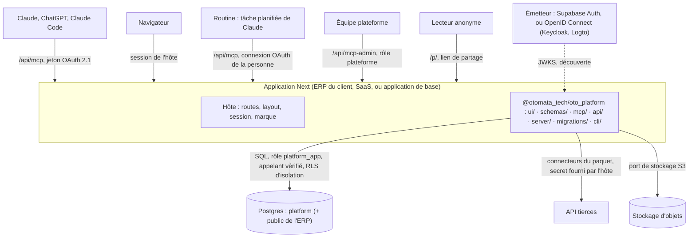

# Vue d'ensemble

- **Statut** : validé avec JB le 23/09/2026
- **Dernière révision** : 2026-10-01

## Résumé

La plateforme est un paquet npm unique, `@otomata_tech/oto_platform`, installé dans une application Next : une application, un domaine, une base, une connexion, un menu (ADR-001). Trois portes minces (le MCP, l'API des écrans, les écrans) s'appuient sur une seule couche de services, `server/`, avec les mêmes schémas Zod, les mêmes erreurs nommées et le même journal. Ce document liste aussi ce qui ne change pas sans décision, et ce qu'on ne reprend jamais d'Oto.

## Contexte

La plateforme sert trois sortes de clients : sans ERP (notre application de base), avec un ERP que nous construisons, ou avec un ERP existant. Deux applications par client (l'ERP et la plateforme) doubleraient le déploiement, la connexion et le menu, et donneraient à notre CI un accès au projet du client. Un « MCP par utilisateur » est inutile : le serveur sait toujours qui appelle. Oto, la plateforme précédente, a servi de banc : elle fournit des détails éprouvés, pas la conception.

## Objectifs et non-objectifs

- Un seul code pour les trois cas de client ; ce qui est sur mesure chez un client est le contenu, les connecteurs, les procédures, l'interface et la marque, jamais le code de la plateforme : un besoin nouveau devient une fonction métier de l'ERP inscrite au catalogue, ou une évolution livrée à tous (ADR-001).
- Un hébergement en France par construction et une intégration native dans l'ERP.
- Hors objectif : une plateforme centrale appelée par les ERP ; une IA côté serveur ; une entité « projet ».

## Conception

### Les portes

| De | Vers | Par |
|----|------|-----|
| Utilisateur | Écrans de l'hôte et du paquet | Navigateur, session de l'hôte (Supabase, ou cookie chiffré en mode OIDC) |
| Claude, ChatGPT, Claude Code | Les six outils ([outils MCP](outils-mcp.md)) | `https://<adresse>/api/mcp`, jeton OAuth de l'utilisateur |
| Équipe plateforme | Huit outils admin ([administration](administration-et-cellule.md)) | `https://<adresse>/api/mcp-admin`, jeton OAuth, rôle plateforme |
| Page de l'hôte (Server Component) | Services du paquet | Import de `@otomata_tech/oto_platform/server`, appelant de la session |
| Écran du paquet (mutation) | API du paquet | `/api/platform/<ressource>`, même origine |
| Lecteur anonyme | Page publique d'un lien de partage | `/p/<jeton>`, sans session ([partage public](partage-public.md), ADR-013) |
| Services du paquet | Schéma `platform` | SQL au nom de l'appelant vérifié, sous RLS d'isolation ([base et portabilité](base-et-portabilite.md), ADR-012 § 1) |
| Services du paquet, navigateur | Stockage compatible S3 | Troisième port ([fichiers et stockage](fichiers-et-stockage.md), ADR-016) ; sans clés S3 de l'hôte, fichiers désactivés |
| Claude Code (`curl`) | Dépôt d'un fichier | `POST /api/platform/uploads/<jeton>`, sans session ([dépôt par lien](depot-par-lien.md), ADR-018) |
| Services du paquet | API des tiers (CRM, mail, ERP) | Connecteurs du paquet, secret fourni par le consommateur ([connecteurs et comptes](connecteurs-et-comptes.md)) |

**Trois cas de client, un seul code.**

|  | Sans ERP | ERP construit par nous | ERP existant |
|---|---|---|---|
| Application | Notre application de base (le SaaS) | L'ERP : le paquet et les modules métier | Notre application de base ; l'ERP reste à part |
| Hébergement | Cellule partagée, plusieurs clients | Cellule dédiée : le déploiement de l'ERP | Cellule partagée, ou dédiée sur exigence |
| Base | Une base partagée, isolée par organisation | La base de l'ERP : `public` pour l'ERP, `platform` pour le paquet | Comme sans ERP |
| Adresse MCP | `<org>.<domaine de base>/api/mcp`, ou un domaine du client | `app.<client>/api/mcp` | Comme sans ERP |
| Fonctions métier | Les connecteurs du catalogue | Les fonctions de l'ERP, inscrites au catalogue | L'ERP comme connecteur |
| Interface | Les écrans du paquet | Les écrans de l'ERP et du paquet, une seule coque | Les écrans du paquet |

Un hôte qui n'est pas une application Next (un backend Python par exemple) n'importe pas le paquet : il prend une application Next dédiée à côté, et l'ERP devient un connecteur. Passer d'une cellule partagée à la base d'un ERP se fait par l'export-import d'une organisation ([administration](administration-et-cellule.md)).

### Le paquet et ses faces (ADR-001)

- Le paquet porte les écrans (`ui/`), l'API (`api/`), le MCP (`mcp/`), les services (`server/`), les migrations du schéma `platform` (`migrations/`) et une ligne de commande (`cli/`), avec un point d'entrée par face. L'utilisateur ajoute un seul connecteur, `https://<domaine>/api/mcp`, à la marque du client. Arborescence et pile : [pile et structure](../reference/pile-et-structure.md).
- Le dépôt est un workspace pnpm : une application de base minimale à la racine, qui monte le paquet depuis le workspace et le teste de bout en bout, et le paquet dans `packages/plateforme/`. Tout autre hôte consomme le paquet publié ([distribution du paquet](distribution-du-paquet.md)).
- **Une seule couche de fonctions sous trois portes** : le MCP, l'API et les écrans sont des adaptateurs minces sur `server/` (carte des modules : [services et portes](../reference/services-et-portes.md)).
- Dépendances entre faces : `ui/` → `schemas/` seulement, données par props, `api/` par HTTP ; `api/` et `mcp/` → `server/` et `schemas/` ; `server/` n'importe ni `mcp/` ni `api/` ; `migrations/` n'est importé par personne. La frontière de `ui/` est appliquée par ESLint, avec un test, pas par la discipline.
- Les schémas Zod partagés vivent dans `packages/plateforme/schemas/`, exporté par `./schemas` et importable par toutes les faces, `ui/` compris : du Zod pur, sans client de base, ni Next, ni autre face (H02).
- Un écran du paquet reçoit ses données de la page serveur de l'hôte, qui appelle `server/` pour l'appelant de la session ; ses mutations passent par `/api/platform/<ressource>` (hôte, puis `api/`, puis `server/`), réponse `{ data }` ou `{ error }` (H03).
- Les services lèvent `PlatformError` avec un code de la liste fermée `PLATFORM_ERROR_CODES` (`server/errors.ts`) et son statut HTTP ; message anglais au MCP, français dans `ui/` ; un test vérifie toujours le code (H04). Sans session, l'API répond 401 avec le code `forbidden` (P36).
- L'hôte monte `/api/mcp`, `/api/mcp-admin` et `/api/platform/[...route]` en routes statiques, et les pages de l'arbre sous `/n/[...chemin]` ; pas de route `api/[transport]` (H06 ; adresses en anglais : [adresses et langue](adresses-et-langue.md)).
- `src/` est l'hôte de référence : ce qu'un ERP ou le SaaS écrit pour monter le paquet, rien de plus ; un appel à un service propre au SaaS (Vercel, DNS, facturation) n'y entre que désactivé par une variable.

### Invariants

Ces choix ne changent pas sans décision écrite dans le document qui les porte. Les quatre invariants de code (Server Components par défaut, Server Actions pour les mutations de l'hôte, un schéma Zod par donnée, RLS sur toute table et décision d'accès dans le service) sont dans `CLAUDE.md § Invariants techniques`.

| Invariant | Document |
|---|---|
| Un paquet npm dans une application Next : une application, un domaine, une seule coque (ADR-001, ADR-008) | ce document ; [écrans et coque](ecrans-et-coque.md) |
| Six outils figés, ajout seulement ; `ctx` exigé partout sauf sur `context` ; préfixe par organisation calculé par requête, immuable ; même contenu texte et structuré (ADR-002) | [outils MCP](outils-mcp.md), [contexte servi](contexte-servi.md) |
| Routage lexical côté serveur, sans embedding ; aucune IA côté serveur ; pas d'entité « projet » (ADR-003) | [routage et recherche](routage-et-recherche.md) |
| Organisation par l'adresse, appartenance revérifiée à chaque appel, OAuth 2.1 auprès de l'émetteur de l'hôte, sans façade (ADR-004) | [identité et connexion](identite-et-connexion.md) |
| Rien de réservé à un hébergeur : tout Postgres 16 avec `pg_trgm`, `unaccent` et `ltree` ; données en France (ADR-005, ADR-012) | [base et portabilité](base-et-portabilite.md) |
| Schéma `platform` : SQL additif, retrait en deux temps, écriture par les services seulement, mises à jour par version et pull request Renovate (ADR-006) | [distribution du paquet](distribution-du-paquet.md) |
| Connecteurs exécutés par le serveur de l'hôte, secret toujours fourni par le consommateur (ADR-019, amendé le 30/09/2026) | [connecteurs et comptes](connecteurs-et-comptes.md) |
| Écrans copiés d'`oto-frontend`, sans routeur imposé, sous `CoquilleOto` ; `ui/` n'importe jamais `server/`, `migrations/` ni un client de base (ADR-008) | [écrans et coque](ecrans-et-coque.md) |
| Transport MCP sans état ; texte seul dans la conversation (ADR-009) | [outils MCP](outils-mcp.md) |
| Paquet public, sans nom réel ni secret dans le dépôt (ADR-010) | [distribution du paquet](distribution-du-paquet.md) |
| Contenu en nœuds typés et en blocs ; une ligne de tableau est un bloc (ADR-011) | [nœuds et arbre](noeuds-et-arbre.md), [pages et blocs](pages-et-blocs.md) |
| L'hôte n'apporte qu'une URL de base et un émetteur ; droits décidés et filtrés dans le service, RLS réduite à l'isolation par organisation (ADR-012) ; un lecteur anonyme ne lit que par une fonction bornée au jeton (ADR-013) | [base et portabilité](base-et-portabilite.md), [partage public](partage-public.md) |
| Fichiers derrière un port de stockage compatible S3, octets jamais en base (ADR-016) ; HTML vu dans un iframe isolé, origine opaque (ADR-017) ; seule porte sans session qui écrit : le ticket d'envoi (ADR-018) | [fichiers et stockage](fichiers-et-stockage.md), [contenu HTML isolé](contenu-html-isole.md), [dépôt par lien](depot-par-lien.md) |
| Toute adresse est en anglais ; l'API des écrans sous `/api/platform/*` (`PLATFORM_API_PREFIX`) ; un renommage sans client se fait sans alias (ADR-020) | [adresses et langue](adresses-et-langue.md) |
| Capacités par organisation déclarées par le paquet, valeurs fournies par l'hôte, refus décidés par le service (ADR-022) ; inscription libre activée par l'hôte seul (ADR-023) | [offres de l'hôte](offres-de-l-hote.md) |

**Réglable sans décision** : l'ordre et le choix des écrans portés ; les seuils de routage (réglage par organisation, 0,65 et 0,1 par défaut) ; le fournisseur d'emails ; la stratégie de cache ; le déploiement de notre application de base.

### Portée V1 et suite

La V1 est prête pour les connecteurs : catalogue avec origine et classe de chaque fonction ; chaîne de résolution du compte écrite ; `accounts.mode` exploité ; confirmation en deux temps ; un connecteur simulé, `mail`, déclaré comme tel. Restent pour la suite : connecteurs tiers réels ; comptes tiers et coffre ; écran Connecteurs ; sondes et alertes ; registre central des versions ; jetons de service hachés ; relance des devis réelle ; widgets dans la conversation. L'état de chaque exigence est dans le [PRD](../produit/prd.md).

### Oto : ce qui ne revient jamais

La plateforme est un noyau neuf, conçu à partir des mesures des bancs. Oto est une source de détails (validation, cas limite, forme d'erreur, algorithme éprouvé, composant d'écran), jamais de conception. Ordre de priorité : les documents de conception, les mesures des bancs, la maquette, Oto. Toute reprise d'un fichier d'Oto dit en une ligne ce qu'elle en reprend et ce qu'elle en retire ; la revue refuse une reprise qui réintroduit une ligne de la colonne « Oto ».

| Sujet | Oto | Plateforme |
|---|---|---|
| Surface | Une centaine d'outils, une toolbox par personne, `oto_call` pour le reste | Six outils figés, tout le reste derrière `call` et `read` |
| Règles | Notice serveur et guide « notice » à lire d'abord ; instructions du serveur MCP | Rien de vital dans la notice ; `context` relu à chaque conversation, parce que `ctx` est requis partout |
| Encadrement | `run_start`, `run_finish`, `_run_id` sur chaque appel | Un code `ctx` par conversation, regroupé dans le journal ; aucun outil de début ni de fin |
| Contexte d'appel | `_org`, `_group`, `_project`, `_account`, `_instance` à passer | `ctx` seul ; organisation par l'adresse, équipe par l'endroit dans l'arbre, compte résolu dans un ordre fixe |
| Comptes | Compte par défaut `is_default`, paliers tenant et plateforme, instance d'une autre organisation | Comptes de l'organisation, d'une équipe ou d'une personne, résolus dans un ordre fixe, jamais hors de l'organisation |
| Routage | Le modèle choisit dans sa toolbox ; `oto_procedure op=list` | Le serveur route : `context(phrase)`, score, seuil, candidats, consigne selon la demande |
| Connaissances | Guides, docs de projet, datastores par numéro, projets, pointeurs par sujet | Un arbre de pages et de tableaux adressé par chemin, résumé obligatoire, liens `[[…]]` ; aucune entité projet |
| Tableaux | 18 outils `data_*`, sentinelles `@keep` / `@empty` / `@clear`, `null` efface, deux formes de lecture | Six fonctions `table.*` derrière `call` ; `set`, `clear`, `verified_empty` ; `null` refusé ; une seule forme |
| Procédures | Objet à part, slots liés par projet, équipement, exécutions | Une page `kind: procedure` : titre, résumé qui dit comment on la demande, appel exact de chaque étape en bloc `call` ; ni slots ni phrases à part |
| Connecteurs | Activation « prochaine session », kits | Catalogue et activation par organisation, effet immédiat |
| Administration | Outils `oto_admin_*` dans la même liste que les outils métier | Tableau de bord et MCP admin séparé |
| Auth | Logto derrière une façade (enregistrement émulé, jetons maison) | Supabase Auth par défaut, ou un émetteur OIDC configuré par l'hôte, sans façade (ADR-004, ADR-012) |
| Données | Base partagée prod et préprod, sans RLS | Schéma `platform`, RLS partout, clé de service hors du paquet |
| IA | Runner Oto côté serveur | Aucune IA côté serveur |

## Décisions et alternatives écartées

- **Deux applications par client (ERP + plateforme)** : deux déploiements, deux connexions à fédérer, deux menus, notre CI chez le client. Écartée (ADR-001).
- **Une plateforme centrale multi-tenant appelée par les ERP** : l'ERP deviendrait un client HTTP, les écrans ne s'intégreraient qu'en cadre, les données du client sortiraient de sa base. Écartée : hébergement en France par construction et intégration native voulus (ADR-001).
- **Les connecteurs d'Oto hors de l'application, dans un service connecteurs** (conséquence neutre d'ADR-001, ADR-007) : remplacé par les connecteurs exécutés dans le paquet ([connecteurs et comptes](connecteurs-et-comptes.md)).
- **Une route `api/[transport]`** pour le MCP : écartée au profit de routes statiques (H06).

## Sécurité et confidentialité

- Une seule application, un seul domaine : aucune CI à nous dans le projet du client ; le paquet n'a aucun accès implicite à l'environnement de l'hôte (ADR-001).
- La frontière `ui/` ↔ `server/` est garantie par l'outillage (règle ESLint et son test) : un écran ne peut pas importer un client de base ni une clé.
- Tout ce que le modèle envoie est validé comme un formulaire public ; le détail est dans [base et portabilité](base-et-portabilite.md) et [droits d'accès](droits-d-acces.md).

## Écart avec le code

- Les éléments de la suite (connecteurs tiers réels, coffre, écran Connecteurs, sondes, registre central des versions, jetons de service, relance des devis) ne sont pas construits ; leurs chantiers sont des issues.
- Restes de ménage ouverts, sans effet sur la conception : `.method/sprint/status.md` (M15b, M52, M61).

## Questions ouvertes

Aucune à ce jour.

## Historique

- 2026-09-23 : un paquet npm unique installé dans une application Next, une application et un domaine par client ; workspace pnpm avec application de base (ADR-001) — décidé par JB (source : ADR-001).
- 2026-09-24 : deux ports (base, identité), droits décidés dans le service (ADR-012) — décidé par JB (source : ADR-012).
- 2026-10-01 : refonte en document de conception vivant, qui reprend ADR-001, les § 1, 8, 9 et 10 de l'ancienne architecture, H02, H03, H04, H06 et P36 — décidé par Alexis, accord de JB.
