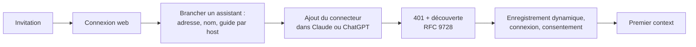
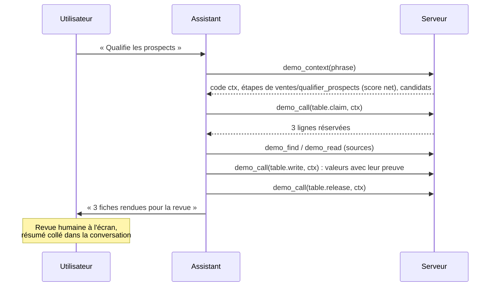
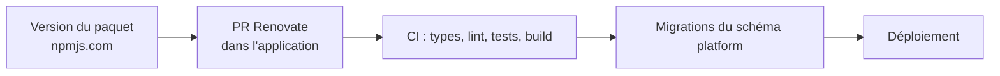

# PRD — Plateforme MCP d'entreprise (`@otomata_tech/oto_platform`)

> Document fonctionnel unique : ce que fait la plateforme, pour qui, et l'état de chaque exigence à
> la fin de la V1. Le document technique est `docs/architecture.md` (tables, fonctions, modules ;
> invariants au § 8) ; les décisions figées sont les ADR de `docs/decisions/`.
> Chaque exigence porte son état : **Livrée**, **Prévue** (après la V1, epic E10), **V2** (reportée) ou **Retirée**. Une exigence
> nouvelle s'écrit dans son parcours, sous un identifiant neuf ; un changement d'état se note dans
> sa colonne « État ».

## 1. Vision

### Le problème

Un consultant sert plusieurs clients ; chaque client a plusieurs équipes et utilisateurs, et des
métiers très différents : ventes, support, exploitation, conseil. Chacun veut faire exécuter ses
procédures maison par l'assistant qu'il paie déjà, Claude ou ChatGPT, sur ses propres outils, avec
ses règles, son ton et ses droits.

Les assistants imposent des limites qui décident de tout le reste (§ 3.1) : ils figent la liste
d'outils d'un serveur, lisent mal sa notice et ses descriptions, ne suivent une consigne que si elle
sert la demande, et leur récit n'est pas une preuve. Un seul levier marche sur tous les hosts : un
champ obligatoire dont la valeur vient d'un de nos outils. La plateforme tient dessus.

### La réponse

Un même serveur MCP sert tous les clients, dans notre application de base ou dans l'ERP de chacun.
Sa liste d'outils ne change jamais : six outils, préfixés par organisation, dont cinq exigent un
code `ctx` remis par le premier, `context`. Tout ce qui vit chez un client (procédures, pages,
tableaux, connecteurs, comptes, droits, règles, ton) est du contenu servi par ces six outils, relu à
chaque conversation sans geste de l'utilisateur. Le serveur reconnaît la procédure demandée par une
recherche lexicale ; l'IA qui exécute est celle de l'utilisateur ; le journal du serveur fait foi.

La plateforme est un paquet npm installé dans une application Next : une application, un domaine,
une base. Il apporte les écrans, l'API, le MCP, les services et les migrations de son schéma.
Chaque client reçoit la plateforme par une version du paquet et ses procédures par du contenu.

Le pilote de la V1 fait qualifier des prospects par l'assistant, dans un tableau, par une procédure,
avec une revue humaine de chaque décision. La V2 branche les connecteurs réels (CRM, mail) et la
relance des devis.

### Principes produit

1. **Surface figée, contenu vivant.** Un besoin nouveau devient une procédure, une page, un tableau
   ou une fonction au catalogue, jamais un outil de plus ; la surface MCP ne fait qu'ajouter.
2. **Le serveur route, l'assistant exécute.** Aucune IA côté serveur, aucun embedding : le serveur
   propose avec un score, le modèle et l'utilisateur tranchent.
3. **Tout s'adresse par un chemin lisible** (`ventes/relance_devis`), jamais par un identifiant :
   c'est ce que disent l'utilisateur et le modèle.
4. **Le modèle voit ce que la personne voit.** Le serveur décide les droits de la personne à chaque
   appel ; un refus dit à qui demander.
5. **Rien ne part sans accord.** Ce qui envoie, supprime ou paie attend l'accord explicite de
   l'utilisateur sur un récapitulatif nominatif.
6. **Le journal fait foi** pour observer, piloter et corriger ; jamais le récit du modèle.
7. **Un client, c'est de la donnée.** Ni branche, ni configuration à redéployer, ni code propre :
   son contenu, ses connecteurs et sa marque sont des lignes.
8. **Le modèle ne paie que le texte utile.** Il lit et écrit le morceau utile ; un résultat ne
   renvoie jamais un document entier.

Les invariants qui en découlent sont listés une fois, dans `docs/architecture.md § 8`.

## 2. Personas

| Persona | Rôle | Objectif | Parcours |
|---|---|---|---|
| Claire | Responsable Ventes chez un client | Faire exécuter les procédures de son équipe par l'assistant, avec les comptes de l'équipe, sans connaître les outils | 5.1, 5.2, 5.4 |
| Marc | Membre du Support | Répondre à un ticket en suivant la procédure et le ton maison | 5.2 |
| JB, consultant | Équipe plateforme (Tiple) | Concevoir, publier, observer et administrer chez chaque client | 5.3, 5.4, 5.5 |
| Admin client | Administrateur d'une organisation | Membres, équipes, droits et marque, depuis l'application, jamais dans une conversation | 5.5 |
| Dev ERP | Construit l'ERP d'un client | Installer le paquet, monter ses écrans, inscrire ses fonctions métier au catalogue | 5.7 |
| Routine | Tâche planifiée de Claude, sous la connexion de la personne | Le même contrat que l'assistant, aux droits de la personne | 5.6 |
| Lecteur externe | Sans compte | Lire un contenu partagé par un lien | 5.4 |

## 3. Le modèle fonctionnel

### 3.1 Ce que la plateforme fait des limites des hosts

| Limite des hosts | Réponse de la plateforme |
|---|---|
| La liste d'outils est figée ; une mise à jour attend un geste de l'utilisateur, et modifier un outil casse les conversations en cours | Six outils, ajout seulement ; un connecteur ou une procédure n'est jamais un outil |
| La notice du serveur n'est pas lue sur claude.ai, coupée à 2 048 caractères sur Claude Code | Rien de vital dans la notice : elle renvoie à `context` |
| Une consigne dans un résultat n'est suivie que si elle sert la demande ; un champ obligatoire nourri par un de nos outils est toujours rempli | Le code `ctx`, remis par `context` et exigé par les cinq autres outils : le contexte est relu à chaque conversation |
| Une description est lue par sa première phrase ; le choix d'outil par l'host se dégrade avec leur nombre | Descriptions courtes, première phrase impérative ; le serveur reconnaît la procédure |
| Claude Code lit le canal structuré, claude.ai et ChatGPT le texte | Le même contenu dans les deux canaux, les données en champs en plus |
| Un résultat est lu en entier jusqu'à 45 000 caractères sur Claude Code (100 000 sur claude.ai, 200 000 sur ChatGPT) ; un appel porte environ 47 000 caractères d'arguments | `context` en 20 000 caractères ; `read` et `call` en 45 000, la suite indiquée ; `write` par morceaux de 20 000 |
| Le récit du modèle n'est pas fiable | Le journal du serveur fait foi |

### 3.2 Les objets

| Objet | Ce qu'il porte | Adressage |
|---|---|---|
| Organisation | Un client : nom, préfixe des outils (immuable), marque, adresses, drapeaux, domaines de travail ; son espace commun, « Tout le monde », dont le Contexte porte mission, règles et ton | Adresse appelée |
| Équipe | Responsable et membres, comptes de connecteurs, son espace dans l'arbre, en tête duquel son Contexte | Nom |
| Personne | Dans une ou plusieurs organisations : rôle (admin ou membre), équipes et équipe par défaut, nom, langue ; son espace « Privé », dont le Contexte porte son ton, sa signature, ses préférences | Jeton |
| Page | Titre, résumé obligatoire (200 caractères au plus), blocs, révisions, enfants ordonnés, liens | Chemin |
| Procédure | Une page de type procédure : titre, résumé qui dit comment on la demande, blocs, chaque appel exact dans un bloc `call` | Chemin |
| Contexte | Une page de type contexte, en tête de son espace, qui ne se supprime ni ne se déplace ; d'autres contenus se rangent dessous | `contexte`, `ventes/contexte`, `private/<handle>/contexte` |
| Tableau | Schéma typé, clé métier, lignes avec provenance par cellule, file de travail | Chemin |
| Connecteur | Nom canonique, fonctions avec schéma et classe (lecture, écriture, sensible) | `table`, `mail`, `erp` |
| Compte de connecteur | Un connecteur, un libellé, un mode (réel, sandbox ou simulé), un état | Libellé |
| Journal | Chaque appel, regroupé par code `ctx` | `journal` |
| Lien public | Un jeton qui ouvre à qui n'a pas de compte la dernière version publiée d'un contenu | `/p/<jeton>` |

Pages, procédures, Contextes, tableaux et comptes appartiennent à l'organisation, à une équipe ou à
une personne. Les quatre premiers sont les types de nœud de l'arbre : le nœud porte les
métadonnées, son contenu est une suite de blocs, lignes de tableau comprises (ADR-011). Le chemin
d'un contenu suit sa place et son titre ; un ancien chemin reste un alias qui y mène toujours.
Tables et colonnes : `docs/architecture.md § 4`.

### 3.3 Ce qui change sans geste

| Ce qui change | Comment l'assistant le voit | Délai |
|---|---|---|
| Une procédure publiée ou modifiée | Nouveautés et procédures utiles de `context` ; `find` ; `read` | Conversation suivante, ou tout de suite si elle est relue |
| Une page ou un tableau | `read` sert la dernière version publiée | Immédiat |
| Un connecteur activé, une fonction inscrite | `find`, `read`, `call` ; nouveautés de `context` | Immédiat |
| Un Contexte publié (règles, ton, préférences) | Le prochain appel des conversations en cours est refusé : « context has changed: call <préfixe>_context again with the same request, then retry this call » ; l'assistant rappelle `context` | Au prochain appel |
| Un outil ajouté au socle, une description allongée | Geste de l'host : nouvelle session sur Claude Code, « Actualiser » sur claude.ai et ChatGPT ; les anciennes listes continuent de marcher | Au geste |

## 4. Design system

Les écrans du paquet reprennent fidèlement ceux d'oto-frontend : son design system, copié tel quel,
et ses huit thèmes, sous la coquille `CoquilleOto` que l'hôte pose une fois, avec une seule coque de
navigation, le rail (ADR-008, `.method/conventions/portage-ecrans.md`). La marque d'une organisation
choisit l'un des huit thèmes, son logo et son nom affiché, et la favicon prend la couleur du thème ; la nuit suit
l'hôte. Tout nœud (page, procédure, Contexte, tableau) s'ouvre à la même adresse de nœud, sans page
de liste par type.

Le jeu de tokens violet du gabarit (oto-saas : `docs/design/system.md`, aperçu `/design-system`) ne vaut que
pour l'hôte-gabarit, hors des écrans du paquet.

Les outils MCP n'ont pas d'écran : l'host (Claude, ChatGPT, Claude Code) est l'interface, en texte
seul dans la conversation (ADR-009).

## 5. Parcours et exigences

### 5.1 Se connecter et brancher son assistant

**Persona :** Claire, Admin client. **Objectif :** entrer dans l'application sur invitation, puis
ajouter le connecteur dans Claude ou ChatGPT avec le même compte, en moins de deux minutes.

On entre par invitation d'un admin ou d'un responsable d'équipe, qui porte le rôle et l'équipe. Le
compte vient du serveur d'autorisation de l'hôte : Supabase Auth par défaut, ou un émetteur OpenID
Connect que l'hôte configure (Logto, Keycloak), sans façade devant lui (ADR-004, ADR-012). Un
consultant membre de deux organisations agit, avec un seul compte, dans celle de l'adresse appelée.

Le nom du connecteur est celui que l'utilisateur saisit, et c'est lui que le modèle voit : le guide
propose un nom qui aide le routage (« Acme assistant ») et, pour un salarié qui n'a qu'un connecteur
d'entreprise sur claude.ai, une phrase de préférences : « Quand une demande concerne mon travail,
commence par l'outil de contexte du connecteur « <Nom> ». » Un consultant branché chez plusieurs
clients ne la pose pas et nomme le client ; ChatGPT et Claude Code n'en ont pas besoin. Guide des
utilisateurs : `docs/pilote/guide-installation.md`.

| Écran | Référence UI | Ce qu'il montre |
|---|---|---|
| Connexion, mot de passe oublié | oto-frontend | Email et mot de passe, lien magique, Google et Microsoft ; thème de l'organisation de l'adresse ; « Données hébergées en France ». Avec un émetteur OIDC, la page de l'émetteur |
| Aucune organisation | Description | Le nom et l'email de l'admin à qui demander |
| Consentement OAuth | Description | Client, compte, organisation, à sa marque ; avertit un non-membre que l'assistant aura accès au compte entier |
| Brancher un assistant | oto-frontend | Adresse, nom recommandé, phrase de préférences, guide par host, prompts d'exemple, dernières connexions |

| ID | Exigence | Priorité | État |
|---|---|---|---|
| FR-CONN-01 | Connexion web par email et mot de passe ou lien magique ; un compte ne se crée que sur une invitation en attente ; une personne sans appartenance voit à qui demander. Avec un émetteur OIDC, l'invitation part par un email de la plateforme, au service d'envoi de l'hôte | Must | Livrée |
| FR-CONN-02 | Connexion des assistants en OAuth 2.1 : découverte sur un 401, enregistrement dynamique et consentement par le serveur d'autorisation de l'hôte, jeton vérifié à chaque appel, jamais de mode anonyme (détail : `docs/architecture.md § 6`) | Must | Livrée |
| FR-CONN-03 | L'organisation vient de l'adresse appelée, jamais du jeton (avec Supabase Auth, le jeton n'est lié à aucune ressource) ; l'appartenance est revérifiée à chaque appel : retirer un membre coupe son accès dès l'appel suivant, révoquer un assistant coupe au rafraîchissement du jeton (une heure) | Must | Livrée |
| FR-CONN-04 | Page « Brancher un assistant » : adresse du serveur, guide par host, nom recommandé, phrase de préférences, prompts d'exemple des procédures publiées de la personne, état de ses connexions ; les métadonnées OAuth y renvoient | Should | Livrée |
| FR-CONN-05 | Google et Microsoft, pour les seules personnes invitées ; SAML sur exigence d'un client, réglé chez l'émetteur de l'hôte (ADR-004) | Could | Livrée pour Google et Microsoft ; SAML : V2, à la première exigence |

| ID | Catégorie | Exigence | Cible | État |
|---|---|---|---|---|
| NFR-CONN-01 | Sécurité | Aucune session côté serveur, aucun état lié à l'adresse IP ou à l'agent (claude.ai et ChatGPT changent d'adresse à chaque requête) ; aucun secret dans une conversation | 0 état réseau | Livrée |
| NFR-CONN-02 | Onboarding | Du clic « ajouter le connecteur » au premier résultat utile | < 2 min | Livrée (guide et page) ; le chronométrage sur un compte neuf reste à jouer |

### 5.2 Faire une tâche avec son assistant

**Persona :** Claire, Marc. **Objectif :** parler ; l'assistant charge le contexte, reconnaît la
procédure, exécute ses étapes avec les bons comptes, demande l'accord quand il le faut, rend compte.

Une demande tient en deux appels avant la première action : `context` avec la phrase de
l'utilisateur, puis `call`. `read` n'intervient que si la procédure n'est pas reconnue nettement ou
dépasse le budget de `context`.

**Les six outils.** Noms en ASCII, `<préfixe>_` + nom ; préfixe propre à chaque organisation,
immuable. Descriptions en anglais, moins de 1 000 caractères, première phrase « Requires the ctx
code from <préfixe>_context; call it first. » ; noms de champs en anglais, figés. Schémas plats :
`arguments` de `call` est un objet libre, décrit par `read` sur la fonction et validé par le serveur.
Phrases de test par outil : `docs/mcp-golden-queries.md`.

| Outil | Rôle | Entrées principales | Exige | Renvoie |
|---|---|---|---|---|
| `context` | Charger la personne, l'organisation, les Contextes, les nouveautés et l'index utile ; router la phrase | `phrase` facultative | rien | contexte par blocs, code `ctx`, candidats avec score |
| `find` | Chercher dans les titres, les résumés et le contenu (blocs, lignes de tableau), et dans les fonctions | `query`, `type` facultatif | `ctx` | trois nœuds et trois fonctions avec score, chacun avec le bloc trouvé et un extrait, ou une question |
| `read` | Lire une procédure, une page, un tableau, le journal ou le contrat d'une fonction ; en plan, par section, depuis une révision, en brouillon | `path`, `section`, `outline`, `since_revision`, `draft`, `refs`, `cursor` | `ctx` | contenu en texte et en structuré |
| `call` | Exécuter une fonction du catalogue après validation, droits et résolution du compte | `function`, `arguments`, `confirm`, `team`, `account` | `ctx` | résultat et suites possibles |
| `write` | Créer ou modifier une page, une procédure, un tableau, par opérations ; brouillon puis publication | `path`, `base_revision`, `title`, `summary`, `kind`, `ops`, `header`, `publish` | `ctx` | révision et différences |
| `feedback` | Signaler une friction, un manque, une erreur d'outil | `type`, `text`, `target` | `ctx` | numéro de ticket |

**Ce que renvoie `context`.** 20 000 caractères au plus, environ 5 000 tokens, qui repartent au
modèle à chaque message : assez pour les étapes complètes de la procédure reconnue, si bien que la
plupart des conversations n'ont besoin d'aucun autre appel avant d'agir.

| Bloc, par priorité | Contenu | Taille nominale |
|---|---|---|
| Règles et candidats | Le code `ctx`, « How this workspace works » (outils, espaces, brouillon et publication, confirmation), la langue de réponse, les candidats avec leur score et la consigne qui les accompagne | toujours servi |
| Procédure reconnue | Son contenu complet, blocs `call` compris, et la consigne d'accord | 4 000 |
| Contexte de Tout le monde | Ligne de faits de l'organisation (nom, domaines), puis mission, lexique, règles, ton de marque, les contenus rangés dessous et les pages liées | 2 400 |
| Contexte de l'espace Privé | Ligne de faits de la personne (nom, rôle, équipes, langue), puis ton, signature et préférences | 1 200 |
| Contextes des équipes | Ligne de faits de chaque équipe (responsable ; pour l'équipe par défaut, connecteurs activés, compte et mode), puis son Contexte ; l'équipe par défaut d'abord | 1 200 chacun |
| Nouveautés | Ce qui a changé dans l'organisation depuis la dernière conversation de la personne | 600 |
| Procédures utiles | Les 60 plus utilisées par la personne et son équipe : chemin et résumé | 8 000 |
| Contenus récents | Les 20 pages et tableaux modifiés ou consultés le plus récemment | 1 400 |

Au-delà du budget partent d'abord les blocs dynamiques, puis les Contextes des autres équipes ;
jamais le code ni la procédure reconnue. Une question qu'aucun bloc ne couvre passe par `find`.

**Reconnaître la procédure.** Trois niveaux : la phrase de préférences sur claude.ai (§ 5.1) ; la
description de `context`, calculée par organisation, qui nomme ses domaines de travail et finit par
la borne « Call it only when the request concerns <org>'s work. Otherwise do not call it. », sans
laquelle un host où deux clients sont branchés appelle les deux ; enfin la recherche du serveur, qui
ne décide jamais seule. Son score, entre 0 et 1, vient du plein texte français et des trigrammes sur
le titre et le résumé (qui porte les façons de demander la procédure, enrichies des demandes lues au
journal), plus des bonus d'équipe et d'usage. Les étapes ne sont servies que si le meilleur candidat
passe le seuil et distance nettement le deuxième (0,65 et 0,1 au départ, réglables par
organisation) ; sinon, les candidats et une consigne : pour une action, demander laquelle lancer ;
pour une question de données (« combien », « lesquels »), chercher et répondre. Les candidats
suivants restent visibles, et `call` garde la main : une mauvaise reconnaissance ne déclenche
jamais plus que ce que l'utilisateur confirme.

**Appels, équipe et compte.** L'équipe est donnée par l'endroit : une procédure sous `ventes/`
s'exécute avec les comptes de Ventes. Le compte se résout dans un ordre fixe : compte nommé dans
l'appel, puis compte de l'équipe qui porte l'appel, puis compte de l'organisation, sinon une erreur
qui dit où le connecter. Une fonction qui envoie, supprime ou paie se fait en deux temps : sans
`confirm`, un récapitulatif nominatif et rien n'est exécuté ; avec `confirm: true`, après l'accord
explicite de l'utilisateur, l'exécution. Quand la procédure a fait approuver le contenu (la liste
des brouillons), cette étape vaut récapitulatif. La consigne servie avec une procédure demande
l'accord avant tout ce qui envoie, ou qui change des données au-delà des étapes de la procédure
demandée.

| ID | Exigence | Priorité | État |
|---|---|---|---|
| FR-TASK-01 | `context` renvoie ses blocs par priorité, coupés par la fin (tableau ci-dessus) : code `ctx`, candidats, procédure reconnue si le score est net, équipe qui portera chaque appel et mode de chaque compte | Must | Livrée (comptes simulés seulement) |
| FR-TASK-02 | Le code `ctx` lie la personne, l'organisation, la version des règles, le host et l'heure ; les cinq autres outils le refusent absent ou invalide, en nommant `<préfixe>_context` ; après la publication d'un Contexte, le refus dit « context has changed » (§ 3.3) | Must | Livrée |
| FR-TASK-03 | Routage lexical côté serveur (ci-dessus). Une demande d'un seul mot peut servir la seule procédure qui lui répond ; une procédure de l'espace « Privé » n'est candidate que pour sa propriétaire ; les phrases de test d'une organisation se rejouent sans host | Must | Livrée ; le score d'une phrase dans l'éditeur de procédure : V2 |
| FR-TASK-04 | `call` vérifie la fonction, son activation, le droit de l'équipe et les arguments ; résout le compte ; exécute ; journalise ; renvoie les suites possibles. Un refus cite l'argument fautif et le contrat à lire, ou dit à qui demander (« écriture réservée à l'équipe Ventes, responsable Claire ») ; le compte-rendu d'une fonction sensible liste ce qui est réellement parti et l'équipe qui a porté l'appel | Must | Livrée (comptes simulés ; connecteurs réels : V2) |
| FR-TASK-05 | Fonctions sensibles en deux temps (ci-dessus), le récapitulatif rappelant le mode du compte ; jamais proposées dans les suites d'un autre résultat | Must | Livrée, sur le `mail` simulé |
| FR-TASK-06 | `find` cherche dans les titres, puis les résumés, puis le contenu publié, et dans les fonctions quand `type` est absent ; filtré par les droits ; une faute de frappe se corrige en dernier recours par les mots du contenu de l'organisation ; l'extrait va jusqu'à la fin du bloc quand il n'en reste que quelques mots | Should | Livrée |
| FR-TASK-07 | `read` (tableau des outils) sert un en-tête (titre, résumé, chemin, parent, enfants, liens, type, statut, version), la référence courte de chaque bloc sur demande, jamais le document entier, et coupe tout résultat à 45 000 caractères en disant comment lire la suite | Should | Livrée |
| FR-TASK-08 | Prompts MCP : un par procédure publiée que la personne peut lire (vingt au plus), dont le message est le titre, que `context` route vers la procédure. Claude Code en fait une commande, claude.ai une pièce jointe, ChatGPT ne les montre pas : le titre et la première ligne se suffisent | Should | Livrée |
| FR-TASK-09 | `feedback` crée un ticket (friction, manque, erreur ; cible), numéroté par organisation (`FB-0001`), lié au `ctx`, recoupé avec le journal et traité par l'équipe plateforme | Could | Livrée |
| FR-TASK-10 | La liste d'outils est calculée à chaque requête avec le préfixe de l'organisation ; la description de `context` nomme les domaines de travail et finit par la borne ; celle de `call` cite des fonctions de l'organisation ; annotations honnêtes (`readOnlyHint` sur `context`, `find`, `read`) et titres lisibles (« Acme Énergies: Load work context ») | Should | Livrée |

| ID | Catégorie | Exigence | Cible | État |
|---|---|---|---|---|
| NFR-TASK-01 | Taille | `context` en 20 000 caractères ; `read` et `call` en 45 000 ; morceaux de `write` de 20 000 | 100 % des résultats sous le plafond | Livrée |
| NFR-TASK-02 | Performance | Latence de `context` | p50 < 1 s, p90 < 1,5 s | Livrée |
| NFR-TASK-03 | Parité | Même contenu en texte et en structuré ; données (identifiants, lignes) aussi en champs | Chaque outil testé | Livrée |
| NFR-TASK-04 | Stabilité | Schémas plats ; descriptions et instructions sans date ni compteur ; ajout seulement ; sur claude.ai et ChatGPT, une description changée n'arrive qu'après « Actualiser », que le guide dit | Contrat `tools/list` testé | Livrée |
| NFR-TASK-05 | Sécurité | Tout ce que le modèle envoie est validé comme un formulaire public : schéma, appartenance, droits | Chaque outil | Livrée |

### 5.3 Observer

**Persona :** JB, Claire. **Objectif :** savoir ce qui s'est passé, conversation par conversation,
et ce qui sert ; le serveur le raconte, jamais le modèle.

Le journal regroupe les appels par code `ctx`, donc par conversation, sans outil de début ni de fin
à demander au modèle. Les demandes restées sans procédure nourrissent les résumés ; les retours des
assistants sont recoupés avec le journal avant toute décision.

| Écran | Référence UI | Ce qu'il montre |
|---|---|---|
| Accueil | oto-frontend | Onglets « Activités » (contenus récents, sans agents ni connecteurs) et « Contexte » (ce que `context` sert à la personne) |
| Profil | Description | Prénom, nom, langue de réponse de l'assistant, couleur (celle de l'organisation par défaut) ; ouvert depuis le menu du compte |
| Page d'un nœud | oto-frontend | Page, procédure, Contexte ou tableau, à la même adresse ; « Contenus liés » : dessous, cités, qui le citent |
| Journal | oto-frontend | Conversations par `ctx`, recherche, filtre et tri dans l'adresse ; appels d'une conversation |
| Usage et retours | Description | Par organisation et équipe : procédures les plus utilisées, erreurs par fonction, demandes sans procédure ; tickets des assistants |

| ID | Exigence | Priorité | État |
|---|---|---|---|
| FR-OBS-01 | Chaque appel est journalisé : `ctx`, personne, équipe porteuse, compte, outil, fonction ou chemin, arguments masqués, tailles, issue, erreur, durée, host ; le journal dit qui a fait quoi, quand, au nom de qui. Un appel sur l'espace privé d'autrui n'en montre qu'outil, heure, issue et espace | Must | Livrée |
| FR-OBS-02 | Écrans de lecture (accueil, page d'un nœud, journal), filtrés par les mêmes droits que `read` | Should | Livrée |
| FR-OBS-03 | `read` du journal par le modèle : ses propres conversations ; celles de son équipe pour un responsable ; toutes pour l'admin et l'équipe plateforme ; bornées, jamais un secret | Should | Livrée |
| FR-OBS-04 | Tableau de bord d'usage par organisation et équipe : procédures les plus utilisées, taux d'erreur par fonction, conversations sans procédure trouvée ; tickets des assistants et leur traitement | Could | Livrée |

| ID | Catégorie | Exigence | Cible | État |
|---|---|---|---|---|
| NFR-OBS-01 | Confidentialité | Le journal ne contient jamais un secret ni un jeton | Chaque fonction sensible testée | Livrée |

### 5.4 Concevoir, organiser, partager

**Persona :** JB, utilisateur avancé, lecteur externe. **Objectif :** créer ou modifier une page, une
procédure, un Contexte ou un tableau, depuis l'assistant ou depuis l'écran ; ranger l'arbre ;
partager un contenu.

**L'arbre.** Les connaissances d'une organisation forment un arbre de nœuds typés, rangé par espace :
« Tout le monde », chaque équipe, puis l'espace « Privé » de chacun. Chaque espace a en tête son
Contexte, créé avec lui. Les liens s'écrivent dans le contenu, là où humains et modèles écrivent.

**Les blocs.** Titre, paragraphe, liste, cases à cocher, code, appel exact (`call`), Mermaid, image,
encart, référence (une page citée ou la vue d'un tableau, rendue au modèle en une ligne), ligne de
tableau (`row`) ; la liste s'étend par ajout. Chaque bloc a un identifiant stable, une clé
facultative, sa provenance (personne, assistant et son `ctx`, import) et sa révision : deux
personnes qui modifient deux blocs d'une page ne se gênent pas.

**Brouillon et publication.** Modifier écrit un brouillon partagé ; publier exige la gestion, fait
avancer la révision et garde un instantané : un membre d'équipe rédige, son responsable publie. À
l'écran, pour qui a la gestion, la publication est seule, 3 s après la dernière frappe et en
quittant la page.

**Procédure.** Un titre, un résumé qui dit comment on la demande, puis des sections faites de blocs ;
des « Étapes » numérotées sont la façon recommandée, la première annonce ce qui va être fait. Le
serveur ne lit que les blocs `call` et les contrôle à la publication. Ni phrases déclencheuses à
part, ni voisines, ni slots, ni entrées. À l'écran, tant que les connecteurs ne sont pas là, une
procédure s'édite et se lit comme une page, en texte seul ; ses blocs `call` s'écrivent par
l'assistant, et `context`, les prompts et le contrôle à la publication restent les siens.

**Tableau.** Pas d'outil à lui : six fonctions derrière `call`, dont `read` sert le contrat.

| Propriété | Pourquoi |
|---|---|
| Schéma typé, clé métier qui fusionne | Écritures idempotentes, en lot ou une à une |
| Provenance par cellule : valeur, commentaire ou lien de preuve, origine | Distinguer ce que le client a remis de ce qu'un assistant a établi |
| Lecture bornée : curseur, colonnes, filtres, texte, comptage, agrégats côté serveur | Jamais une table entière dans le contexte |
| File de travail : état, réservation avec bail et nom du travailleur, libération | Assistants et routines en parallèle sans collision |
| Revue humaine : une fiche, deux décisions, résumé à coller dans la conversation | Un humain décide, l'assistant reprend |
| Garde de révision | Une écriture calculée sur une lecture périmée est refusée |

Une écriture est faite d'opérations explicites : `set`, `clear`, `verified_empty` avec sa raison ;
un champ non nommé reste intact, `null` est refusé. Une valeur nouvelle porte sa preuve
(`{value, comment | link}`), sinon l'appel est refusé ; la colonne d'état s'écrit nue, dans les
transitions permises. Dans un lot, seule la ligne fautive est refusée. Une ligne s'écrit sans
brouillon ; le schéma suit la publication du nœud.

**Organiser depuis l'écran.** Le rail crée une page, un tableau ou une procédure sous tout nœud,
sans modale ; un contenu se glisse-dépose sur un autre pour en devenir l'enfant, ou entre deux
frères ; un déplacement qui change qui voit le contenu le dit avant de partir. Une suppression met
le contenu et ses sous-contenus à la corbeille, hors du rail, des recherches et des assistants,
restaurables 30 jours sous leur plus proche ancêtre encore là. « Partager » donne à chacun son
niveau (« Accès complet », « Peut modifier », « Peut lire ») et règle l'accès général : les
personnes ajoutées, ou toute l'organisation à un niveau.

**Partager hors de l'organisation.** Qui a l'accès complet active un lien public : la dernière
version publiée, en lecture seule, au thème de l'organisation, et au choix ses sous-contenus, dans
la limite de ce que l'auteur du lien lit à cet instant ; un tableau s'y montre en grille de lecture
(valeurs publiées, 500 lignes au plus) ; ni brouillon, ni droits, ni preuves, ni journal. La
structure de l'arbre (racine, espaces, Contextes, dossiers d'équipe) ne se partage pas. La page
n'est jamais indexée ; un lien désactivé ou inconnu rend
« introuvable » ; l'admin voit et désactive les liens de son organisation (ADR-013).

| Écran | Référence UI | Ce qu'il montre |
|---|---|---|
| Éditeur de page | oto-frontend | Titre et résumé en place, blocs à la poignée (menu, glisser-déposer, styles), « @ » pour citer un contenu, liens cliquables, publication seule |
| Procédure | oto-frontend | Même éditeur et même lecture qu'une page, texte seul ; un bloc `call` déjà écrit s'y lit en texte |
| Contexte | oto-frontend | Même éditeur ; aperçu du contexte d'une personne |
| Tableau | oto-frontend | Grille avec tri, filtres, agrégats, défilement horizontal en fenêtre étroite ; file de revue (choisir la fiche, passer, preuves des valeurs, raison copiée) |
| Rail | oto-frontend | Arbre par espace, création, glisser-déposer, Déplacer, Partager, corbeille |
| Page publique | Description | Contenu publié en lecture seule, sans session |

| ID | Exigence | Priorité | État |
|---|---|---|---|
| FR-CONC-01 | `write` opère sur une section adressée par son titre (remplacer, insérer, supprimer, ajouter, remplacer un passage) ou sur un bloc adressé par sa référence courte (remplacer, insérer après, supprimer, déplacer) ; brouillon puis publication ; une écriture sur une révision périmée est refusée avec l'état actuel, bloc par bloc ; la réponse donne la révision, les différences et le nouveau chemin si le titre a changé | Must | Livrée |
| FR-CONC-02 | Procédure (ci-dessus) : à la publication, le serveur vérifie que chaque fonction, argument et état cité par un bloc `call` existe et est accepté ; le refus nomme la section, le rang du bloc, l'étape qui le précède, la fonction et l'élément fautif | Must | Livrée |
| FR-CONC-03 | Éditeurs web de page, de procédure et de Contexte, repris d'oto-frontend : titre et résumé en place, poignée de bloc, publication seule pour qui a la gestion, « @ », aperçu de ce que le modèle recevra d'un Contexte ; une procédure s'y édite comme une page | Should | Livrée ; à l'écran, le bloc d'appel, le contrôle du brouillon et le score d'une phrase (« Tester une phrase ») d'une procédure : V2, avec les connecteurs |
| FR-CONC-04 | Les nouveautés de l'organisation (pages et procédures publiées, connecteurs activés) apparaissent dans `context` à la conversation suivante ; le bloc est omis quand rien n'a changé depuis une conversation du jour même ; la publication d'un Contexte invalide les codes `ctx` en cours. Aucune note de version de la plateforme n'y figure | Should | Livrée ; les notes de version de la plateforme : Retirées (elles n'aidaient pas la demande de l'utilisateur) |
| FR-CONC-05 | Tableaux (ci-dessus) : création et évolution du schéma par `write` ; six fonctions derrière `call` (`table.schema`, `rows`, `aggregate`, `write`, `claim`, `release`), dont le contrat dit la forme de la preuve et l'ordre de réservation ; revue humaine à l'écran | Must | Livrée |
| FR-CONC-06 | Liens `[[chemin]]` et `[[chemin#clé]]` extraits des blocs publiés avec leur bloc source, indexés sortants et entrants, servis par l'en-tête de `read` et par « Contenus liés » ; un déplacement ou un renommage laisse l'ancien chemin en alias | Could | Livrée |
| FR-CONC-07 | Import et export sans type de contenu nouveau : un markdown collé ou un `.md` déposé devient les blocs d'une page (mode tolérant à l'écran, strict pour `write`), une page s'exporte en `.md` ; un CSV devient un tableau typé (types et clé déduits, modifiables), un tableau s'exporte en CSV ; `table.import` derrière `call` ; un tableau simple se convertit en tableau de données (E10-S01) | Should | Prévue |
| FR-CONC-08 | Images et fichiers déposés dans une page, stockés derrière un port S3 configuré par l'hôte (ADR-016), lus sous les droits du nœud, par lien public compris ; l'assistant en lit le nom et le texte alternatif (E10-S02) | Should | Prévue |
| FR-CONC-09 | Bloc `html` : une page HTML (un artefact généré par Claude Code) déposée par l'écran ou par `write`, exécutée isolée, sans accès à l'hôte (ADR-017) ; servie aussi par lien public, sous une bannière (E10-S03) | Could | Prévue |
| FR-CONC-10 | Une page affiche le markdown d'un assistant sans balisage visible : tableau simple (`simple_table`, distinct du nœud tableau), séparateur, repli (`
`), listes imbriquées sur trois niveaux, titres `##` à `######` (cinq niveaux), barré, échappements, ` `, marques imbriquées ; aller-retour `read` / `write` gardé (E10-S04) ; l'éditeur les écrit par le choix du « + » et de `/` (E10-S06) | Should | Prévue |
| FR-CONC-11 | Un assistant qui a déjà un fichier (Claude Code) le dépose sans le réécrire : `upload.link` derrière `call` rend un lien à usage unique (15 min, 1 Mo, lié à la personne et à la destination), l'assistant y envoie le `.html`, le `.md` ou le CSV par `curl`, le service revérifie les droits à l'envoi (E10-S05) | Should | Prévue |
| FR-CONC-12 | Organiser l'arbre depuis l'écran (ci-dessus) : création sans modale, glisser-déposer, Déplacer avec son impact, Dupliquer (« <titre> (copie) », sous-contenus et lignes compris, sans les règles explicites), corbeille de 30 jours ; le chemin suit le titre, le premier libre s'il est pris ; sous un Contexte se rangent d'autres contenus | Must | Livrée |
| FR-CONC-13 | Partage public d'un contenu par lien (ci-dessus, ADR-013) | Should | Livrée |

| ID | Catégorie | Exigence | Cible | État |
|---|---|---|---|---|
| NFR-CONC-01 | Coût | Le modèle lit le plan, une section ou ce qui a changé, et n'écrit que le texte nouveau (un paragraphe, environ 60 tokens) ; un résultat ne renvoie jamais le document entier | Mesuré au journal (tailles) | Livrée |
| NFR-CONC-02 | Intégrité | Toute écriture passe par les services du paquet : révision, provenance, journal, droits | 0 écriture directe dans le schéma | Livrée |
| NFR-CONC-03 | Confidentialité | Un lien public ne sort que du périmètre de son jeton : ni autre nœud, ni sous-nœud non inclus, ni ce que son auteur ne lit pas, ni brouillon, ni autre organisation | Un test par cas | Livrée |

### 5.5 Administrer

**Persona :** Admin client, JB. **Objectif :** organisation, marque, équipes, membres, droits,
connecteurs ; depuis l'application ou le connecteur admin, jamais par les six outils.

**Droits.** Tout ce qui se protège est un nœud de l'arbre ou un compte de connecteur ; les droits
s'héritent par l'arbre. Rôles : administrateur d'organisation et membre ; chaque équipe a un
responsable. L'équipe plateforme (les consultants) reçoit un accès à une organisation à sa création,
visible et révocable par l'admin du client, et journalisé.

| Niveau | Sur un nœud | Sur un compte de connecteur |
|---|---|---|
| Aucun | Invisible | Inutilisable |
| Lecture | Lire, être trouvé par `find`, apparaître dans `context` | Fonctions de lecture |
| Écriture | Modifier le brouillon, créer des enfants | Fonctions d'écriture ; les sensibles, en deux temps |
| Gestion | Publier, déplacer, poser des règles, partager | Partager, révoquer |

Sans règle, le propriétaire décide : l'espace commun est lisible par tous ; un nœud d'équipe est
modifiable par l'équipe, géré par son responsable, invisible aux autres ; un nœud privé n'est vu que
de sa propriétaire. L'admin et l'équipe plateforme gèrent tout, sauf les espaces privés et ce qu'un
gestionnaire rend privé. Une règle vise une personne, une équipe ou toute l'organisation (ADR-014) et
vaut pour le sous-arbre, sauf règle plus proche ; à un même nœud, la plus précise l'emporte (personne, équipe, organisation), et une règle d'organisation ne retire rien au propriétaire. Un responsable partage
hors de son équipe en lecture ou en écriture ; une règle de gestion reste à l'admin. `context`,
`find` et `read` sont filtrés, `write` et `call` vérifiés, par le serveur avant sa requête ; la base
n'isole que les organisations entre elles (ADR-012).

**Connecteurs.** Déployer n'est pas activer : rien n'existe chez un client tant qu'un connecteur n'y
est pas activé, à effet immédiat. Trois étages : le catalogue (fonctions avec schéma, classe et
origine) ; l'activation par organisation, posée par l'équipe plateforme ; les comptes, dont l'usage
suit les droits. Cent connecteurs ne changent rien pour le modèle : `context` dit ceux de l'équipe
en une ligne, `find` cherche une fonction, `read` sert un contrat. En V1, le catalogue porte les
fonctions des tableaux, les fonctions métier de l'ERP hôte et un `mail` simulé, déclaré comme tel ;
les connecteurs réels et leur coffre viennent en V2, écrits en TypeScript dans le paquet (ADR-019).

**Le connecteur admin.** Un second point d'entrée, réservé à l'équipe plateforme, sur les services
du tableau de bord : séparé, parce qu'un admin est souvent aussi utilisateur et qu'un rôle retiré ne
doit rien laisser en cache. Huit outils, une opération par appel : `admin_context`, `admin_org`,
`admin_team`, `admin_connector`, `admin_node`, `admin_cell`, `admin_journal`, `admin_feedback`.
L'organisation visée est un argument explicite ; une opération destructive passe en deux temps.

| Écran | Référence UI | Ce qu'il montre |
|---|---|---|
| Équipes et accès | oto-frontend | Membres, invitations, équipes et responsables, règles d'accès par nœud, accès de l'équipe plateforme, confirmation avant un retrait |
| Partager | Notion, style d'oto-frontend | Qui a accès et à quel niveau, accès général, lien public |
| Tableau de bord | oto-frontend | Réglages de l'entreprise (organisation, marque, langue, Contexte de Tout le monde, liens publics), connecteurs activés ; usage et retours (§ 5.3) |
| Corbeille | Description | Contenus supprimés, restauration |

| ID | Exigence | Priorité | État |
|---|---|---|---|
| FR-ADMIN-01 | Organisation (nom, préfixe des outils immuable, marque, domaines de travail, drapeaux, version des règles), créée par l'équipe plateforme, qui seule y rattache une adresse (et, dans la cellule partagée, un sous-domaine quand l'hôte le configure) ; équipes et responsables ; membres avec rôle (admin, membre) et équipe par défaut ; accès de l'équipe plateforme visible et révocable par l'admin | Must | Livrée ; le rôle « service » : Retiré (une routine agit sous la personne, § 5.6) |
| FR-ADMIN-02 | Catalogue, activation par organisation à effet immédiat, usage des comptes réglé par les droits (ci-dessus) ; comptes de connecteurs au coffre, chiffrés, secret jamais renvoyé | Must | Livrée avec des comptes simulés ; le coffre et les comptes tiers : V2 |
| FR-ADMIN-03 | Droits hérités par l'arbre (ci-dessus), sur les nœuds et les comptes, pour une personne, une équipe ou toute l'organisation, décidés par le serveur à chaque appel | Must | Livrée |
| FR-ADMIN-04 | Écrans d'administration repris d'oto-frontend : Équipes et droits, Partager, tableau de bord ; écran Connecteurs et comptes pour l'admin client (activation, comptes, usage, santé) | Should | Livrée, sauf l'écran Connecteurs et comptes : V2 |
| FR-ADMIN-05 | Deux classes d'identité de compte : les systèmes de l'organisation (compte d'équipe, auteur journalisé) et les canaux personnels (compte de la personne) ; opérer au nom d'une autre personne exige une autorisation explicite, que `context` rappelle (« tu écris avec le Gmail de Marie »), et le journal porte les deux personnes | Should | V2 |
| FR-ADMIN-06 | Connecteur admin `/api/mcp-admin`, huit outils par objet, rôle plateforme exigé (401 sans lui, rien d'annoncé), journal à part | Could | Livrée |
| FR-ADMIN-07 | Drapeaux par organisation (une fonction qui change un comportement s'ouvre client par client, fermée elle garde le comportement d'avant) ; version du paquet et migrations appliquées lues par `admin_cell` ; registre central des versions de plusieurs applications | Could | Livrée, sauf le registre central : V2 |
| FR-ADMIN-08 | Connecteurs distants : un serveur MCP ou HTTP tiers enregistré par une ligne (adresse, authentification), dont la passerelle relit les outils et les range au catalogue sous un espace de noms ; retrait par dépréciation (« retiré, utilisez X » pendant un délai), alias d'un connecteur à un autre, contrôle des procédures qui citent une fonction dépréciée ou un connecteur sans compte | Could | V2 |

| ID | Catégorie | Exigence | Cible | État |
|---|---|---|---|---|
| NFR-ADMIN-01 | Sécurité | Le secret d'un compte ne revient jamais vers un écran, le modèle ou le journal ; il ne sert qu'à l'appel du tiers, depuis le serveur de l'hôte | Test sur chaque chemin | Livrée pour la V1, qui n'a aucun secret de compte ; le coffre : V2 |
| NFR-ADMIN-02 | Isolation | Dans la cellule partagée, une organisation ne lit ni n'écrit aucune ligne d'une autre, par aucune porte | Test par table et de bout en bout | Livrée |

### 5.6 Routine

**Persona :** Routine. **Objectif :** une tâche planifiée de Claude appelle le MCP sous la connexion
OAuth de la personne qui l'a créée : même contrat (`context` puis `call`), mêmes droits, aucune IA
côté serveur, aucune surface propre à la plateforme. L'équipe plateforme fait de même pour ses
propres routines.

| ID | Exigence | Priorité | État |
|---|---|---|---|
| FR-ROUT-01 | Une routine appelle le même contrat, aux droits de qui la lance, et s'arrête avec eux : une personne retirée de l'organisation voit l'appel suivant refusé ; une écriture hors de ses droits est refusée et journalisée à son nom. Jetons de service émis depuis l'administration : piste | Should | Livrée (tâche planifiée de l'assistant) ; jetons de service : V2 |
| FR-ROUT-02 | Sondes de santé par connecteur et par compte, alerte sur un compte expiré, état « en défaut » et date à l'écran | Could | V2 |

### 5.7 Installer la plateforme dans une application

**Persona :** Dev ERP. **Objectif :** installer le paquet dans une application Next ; les écrans,
l'API, le MCP et les migrations arrivent par une version ; les fonctions métier de l'ERP
s'inscrivent au catalogue.

**Trois cas, un seul code.** Un client sans ERP vit dans notre application de base, en cellule
partagée : le gabarit et le paquet, sans modules métier. Un client dont on construit l'ERP reçoit la
plateforme dans cet ERP : une application, un domaine, une base, une connexion, un menu, et un seul
connecteur à ajouter, à l'adresse de l'ERP. Un client qui a déjà son ERP reste sur l'application de
base et branche l'ERP comme connecteur. Un besoin nouveau devient une fonction métier de l'ERP ou une
évolution livrée à tous, jamais du code propre à un client.

**Monter les écrans.** Trois niveaux, tous exportés par le paquet : la coque entière (le rail) ; les
morceaux du rail dans la coque de l'ERP ; un écran seul dans une page de l'ERP, comme la vue d'un
tableau dans une fiche client. Une seule coque est visible. L'ERP lit les tableaux par les services
du paquet (`table.rows`, `table.aggregate`), jamais par une requête à côté.

**Fonctions métier.** Un outil propre à un client est une fonction de son ERP, jamais un outil de
plus : un schéma Zod, un service, une ligne qui l'inscrit au catalogue (`erp.create_invoice`) ;
`find` la trouve, `read` sert son contrat, `call` l'exécute sous le jeton de l'utilisateur, une
procédure l'appelle par un bloc `call`. Un besoin sans code passe d'abord par une procédure ou un
tableau. Installation d'un hôte : `docs/architecture.md § 7`.

| ID | Exigence | Priorité | État |
|---|---|---|---|
| FR-INST-01 | Un paquet à faces séparées (`ui/`, `schemas/`, `mcp/`, `api/`, `server/`, `migrations/`, `cli/`), un point d'entrée par face, développé dans un workspace avec une application hôte de référence | Must | Livrée |
| FR-INST-02 | L'application hôte consomme le paquet pour de vrai : routes qui montent le MCP, l'API et les écrans, feuille de style du paquet, coque au thème de l'organisation, à l'un des trois niveaux d'intégration | Must | Livrée |
| FR-INST-03 | Frontière : `ui/` n'importe jamais `server/`, `migrations/` ni un client de base ; une règle de lint, prouvée par un test | Must | Livrée |
| FR-INST-04 | Les migrations du paquet ne touchent que le schéma `platform` et, après la ligne de base de la V1, ne font qu'ajouter ; l'hôte les copie par la CLI du paquet et les applique par son propre workflow ; un contrôle CI refuse toute migration qui en sort | Should | Livrée |
| FR-INST-05 | Publication publique sur npmjs.com en version sémantique, avec provenance, sous le scope de l'organisation npm Otomata (ADR-010) ; chaque application épingle sa version et la monte par pull request Renovate, fusionnée si la CI est verte, sauf version majeure | Should | Livrée |
| FR-INST-06 | Une fonction métier de l'ERP s'inscrit au catalogue (ci-dessus) | Should | Livrée |
| FR-INST-07 | Export-import d'une organisation, de la cellule partagée vers l'ERP : toutes ses lignes, chemins, révisions et corbeille compris ; les accès de l'équipe plateforme importés sont révoqués ; une personne dont le compte cible n'a pas d'email confirmé n'est pas rapprochée. Outillage du dépôt, lancé par l'équipe plateforme | Could | Livrée |

| ID | Catégorie | Exigence | Cible | État |
|---|---|---|---|---|
| NFR-INST-01 | Portabilité | L'hôte n'apporte qu'une base Postgres et un émetteur OIDC : Supabase (Cloud en France ou auto-hébergé) par défaut, ou tout Postgres qui admet `pg_trgm`, `unaccent` et `ltree`, préparé par la CLI du paquet (ADR-005, ADR-012) | Suite portable sur un Postgres nu en CI | Livrée |
| NFR-INST-02 | Surface | Un module du paquet n'existe que s'il sert un parcours d'aujourd'hui | Revue de chaque changement | Livrée |

## 6. Portée : V2 et hors périmètre

**V2, reportée** : les exigences marquées « V2 » dans leur parcours, autour des connecteurs réels ;
les widgets dans la conversation (texte seul d'ici là, ADR-009) ;
le pilote de la relance des devis sur un CRM et un mail réels ; la description OpenAPI de l'API,
générée des mêmes schémas. La V1 est prête pour eux : catalogue avec origine et classe, résolution
du compte écrite, mode des comptes servi, confirmation en deux temps, `mail` simulé
(`docs/architecture.md § 9`).

**Hors périmètre** : toute IA côté serveur, tout embedding, toute entité « projet » ; une vue du paquet intégrée en cadre dans un ERP
existant (les en-têtes l'interdisent aujourd'hui, à rouvrir par ADR) ; les notifications du serveur
vers l'host (transport sans état) ; ce
qu'Oto fait et qui ne revient pas (`docs/architecture.md § 10`).

## 7. Hypothèses et risques

**Hypothèses**
- Les connecteurs de la V2 s'écrivent en TypeScript dans le paquet et portent le CRM et le mail ;
  le secret du compte vient du coffre du paquet (ADR-019).
- Un émetteur OIDC tiers (Logto, Keycloak) offre aux trois hosts un OAuth 2.1 qu'ils savent joindre,
  sans façade : prouvé en local sur Keycloak, pas encore sur claude.ai et ChatGPT.

| Risque | Impact | Mitigation |
|---|---|---|
| Les hosts changent leurs caches, troncatures et gestes | Un contrat qui marchait cesse de marcher | Golden queries rejouées à chaque évolution (`docs/mcp-golden-queries.md`) ; surface figée |
| L'enregistrement dynamique des clients cède la place aux Client ID Metadata Documents dans la spécification MCP | Un host nouveau ne s'enregistre plus chez l'émetteur | Émetteur choisi sur sa prise en charge des deux ; mesure à chaque émetteur nouveau |
| Le rafraîchissement silencieux d'un jeton au-delà d'une heure n'a pas été éprouvé en campagne | Un host qui ne se reconnecte pas seul | Retirer le membre reste la coupure immédiate ; mesure à la première campagne longue |
| Un autre connecteur de l'utilisateur capte une demande (un connecteur de prospection tiers, Slack) | `context` n'est pas appelé, la procédure pas servie | Nom du connecteur et phrase de préférences ; effet de la phrase à mesurer sur claude.ai |
| Une paraphrase éloignée du résumé n'est pas servie ; une question de données ressemble à une procédure | Une question de plus, ou une procédure servie à tort | Résumés enrichis des demandes du journal ; consigne données ou action ; aucune écriture sans l'étape demandée |
| ChatGPT bloque un appel avant le serveur, ou écrit sans preuve | Une étape manque, ou une valeur sans source | Compte-rendu identifiant par identifiant ; `table.write` refuse une valeur nouvelle sans preuve |
| Un jeton de lien public fuite | Lecture du contenu jusqu'à la désactivation | Lien révocable, listé à l'admin, jamais indexé |

## 8. Métriques de succès

Le verdict se lit au journal, jamais au récit du modèle. S'y ajoutent les cibles des exigences
non fonctionnelles (latence, onboarding).

| Métrique | Cible | Mesure |
|---|---|---|
| `context` premier appel d'une conversation de travail | 100 % sur les trois hosts | Journal regroupé par `ctx` |
| Bonne procédure sur les golden queries | ≥ 95 % des demandes directes et indirectes ; 0 négatif déclenché | `docs/mcp-golden-queries.md` rejouées sur claude.ai, ChatGPT et Claude Code |
| Reconnaissance sans host | ≥ 95 % des formulations du résumé servies ; 0 négative | Tests de routage de chaque organisation |
| Envoi sans accord | 0 | Aucun `confirm: true` avant le tour d'accord |
| Valeur écrite sans preuve ; décision hors de la revue humaine | 0 | Provenance des cellules ; origine des décisions |
| Mise à jour sans geste | 100 % des changements de règles repris au prochain appel | Refus « context has changed », puis nouveau `context` |
