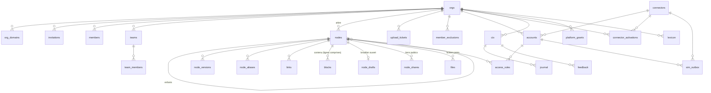

# Schéma `platform`

> Ce qu'on consulte : les tables, fonctions SQL, déclencheurs et policies du schéma `platform`. Les décisions qui les fondent sont dans [la conception](../conception/README.md) : [base et portabilité](../conception/base-et-portabilite.md), [nœuds et arbre](../conception/noeuds-et-arbre.md), [droits d'accès](../conception/droits-d-acces.md).

## Modèle de données

Tout vit dans le schéma `platform`, avec `org_id` sauf exception notée. Une personne est un
identifiant interne (`uuid`, sans clé vers un annuaire), que `identities` traduit du sujet de
l'émetteur ; son email et son nom sont des copies dans `members` et `platform_staff`. Le contenu
suit ADR-011 : des nœuds typés faits de blocs, dans une seule table ; une ligne de tableau est un
bloc `row`. Les nouveautés servies par `context` se calculent (versions publiées, activations) :
elles n'ont pas de table. Il n'y a pas d'équipe « Tout le monde » : l'organisation entière est un
sujet de règle (ADR-014).

### Tables

| Table | Rôle | Colonnes |
|-------|------|----------|
| `orgs` | Un client | `slug`, `name`, `prefix` (immuable), `brand` `{theme, logo_url, display_name, language?}` (`theme` : un des huit thèmes d'Oto, couleur de tout compte sans choix ; `language` : langue de réponse par défaut), `settings` `{domains, routing: {threshold, gap}, demo}` — `domains` : les domaines de travail cités par la description de `context` (chaîne libre en anglais), `demo` : organisation de démonstration, seule que le script Démo resème —, `flags`, `rules_version` |
| `org_domains` | Adresse → organisation | `host` (clé, minuscules, sans port), `org_id` ; rattachée par l'équipe plateforme seule |
| `invitations` | Invitation en attente | `email` (minuscules), `role` (`admin` · `member`), `team_id`, `invited_by`, `expires_at` (7 jours), `accepted_at`, `accepted_by`, `declined_at`, `revoked_at` |
| `members` | Une personne dans l'organisation | `user_id`, `role` (`admin` · `member`), `default_team_id`, `profile` `{name, first_name, last_name, handle, language, theme}` (`handle` unique dans l'organisation ; `name` recomposé du prénom et du nom par `update_my_profile`) ; `email`, `name`, `last_sign_in_at` : copies posées à chaque connexion ; un membre nouveau reçoit son espace `private/<handle>`, titré « Privé » |
| `teams`, `team_members` | Équipes et appartenance | `slug` (ni `guide`, ni `perso`, ni `private`, ni `contexte`, ni `journal` ; ni `functions`, refusé par le service seul), `name`, `lead_user_id` ; `team_members.role` (`lead` · `member`), dérivé du responsable |
| `nodes` | Page, procédure, Contexte ou tableau (métadonnées ; le contenu est dans `blocks`) | `parent_id` (racine : null), `path` (unique par organisation ; suit le titre, segment de 60 caractères au plus coupé au dernier mot entier, l'ancien reste un alias ; un chemin pris donne le premier libre, `<segment>_2`, `_3`…, jamais un refus ; les espaces personnels sous `private`, anciens chemins `perso/…` gardés en alias), `lpath` (ltree généré), `kind` (`page` · `procedure` · `context` · `table` ; `context` ⇔ chemin de Contexte), `title` (≤ 200), `summary` (1 à 200), `status`, `revision` (0 = jamais publié), `position` (ordre parmi les frères ; nul = rangé par chemin), `deleted_at` (corbeille), `meta` (schéma d'un tableau seulement), `owner_kind` / `owner_team_id` / `owner_user_id` (null = hérité), `created_by`, `updated_by`, dates, `search_tsv` (générée : titre poids A, résumé poids B) |
| `node_drafts` | Brouillon ouvert d'un nœud | `node_id` (clé), `base_revision`, en-tête en attente (`title`, `summary`, `kind`, `meta`), `created_by`, `updated_by`, dates |
| `blocks` | Tout le contenu : blocs des documents et lignes des tableaux | `id` (fabriqué par la base), `state` (`draft` · `published`), `org_id` (posé par la base), `node_id`, `position`, `type` (`heading` · `paragraph` · `list` · `checklist` · `code` · `call` · `mermaid` · `image` · `callout` · `reference` · `simple_table` · `divider` · `toggle` · `file` · `row` ; titres de niveau 1 à 5, listes imbriquées sur trois niveaux ; `file` : `{file_id, name, size, mime}`, repris de la ligne `files` ; `image` : `src` (`https`) ou `file_id`, jamais les deux, et `width` facultatif `small` · `medium` · `full`), `text` (nul pour un `row` et un `file`), `data`, `key` (obligatoire et immuable pour un `row`), `provenance`, `revision`, `claimed_by`, `claimed_by_user`, `lease_until`, auteurs, dates, `search_tsv` ; clé (`id`, `state`) ; unique (`node_id`, `state`, `key`) |
| `node_versions` | Historique publié | `node_id`, `revision`, `title`, `summary`, `kind`, `meta`, `blocks` (instantané des blocs publiés ; sans lignes pour un tableau), `author`, `created_at` |
| `node_aliases` | Anciens chemins | `old_path`, `node_id` ; clé (`org_id`, `old_path`) |
| `links` | Liens `[[…]]` et blocs `reference` | `source_node_id`, `source_block_id`, `target_path`, `target_key` (`[[chemin#clé]]`), `target_node_id` (null si sans cible) |
| `node_shares` | Lien public d'un nœud (ADR-013) | `node_id`, `token` (43 caractères base64url, unique), `include_children`, `created_by`, `created_at`, `revoked_at` ; un seul lien actif par nœud |
| `files` | Fichier joint à un nœud (ADR-016) : métadonnées seules, les octets dans le stockage sous la clé `<org_id>/<id>` | `node_id` (cascade), `name` (1 à 255, jamais dans la clé), `mime`, `size` (1 octet à 50 Mo), `status` (`pending` · `ready` ; insertion `pending` seule), `created_by`, `created_at` ; quota de 10 Go par organisation sous le verrou 7501 ; un fichier appartient à un seul nœud |
| `upload_tickets` | Ticket d'envoi d'`upload.link` (ADR-018), jamais exporté | `user_id`, `ctx`, `token_hash` et `form_token_hash` (empreintes SHA-256 des jetons de `curl` et du formulaire, uniques, jamais un jeton), `kind` (`file` · `md` · `csv`), `mode`, `target_path`, `name`, `title`, `summary`, `key`, `base_revision`, `publish`, `expires_at` (15 minutes), `used_at` ; lu par sa personne et, expiré, par tout membre ; aucune mise à jour hors `consume_upload_ticket` |
| `member_exclusions` | Personne retirée d'une organisation par un administrateur : l'entrée sans invitation la refuse ; jamais exportée | `org_id`, `user_id` (clé), `excluded_at`, `excluded_by` ; inscrite par `removeMember`, levée par une invitation acceptée, supprimée par `forget_user` |
| `access_rules` | Un droit | `node_id` **ou** `account_id` ; exactement un sujet : `subject_team_id`, `subject_user_id` ou `subject_org` (nœud seulement, ADR-014) ; `level` (`none` · `read` · `write` · `manage`) ; unique par cible et sujet |
| `platform_staff` | Équipe plateforme (sans `org_id`) | `user_id` (clé), `email`, `name`, `added_by`, `added_at` ; écrite par l'outillage seul |
| `platform_grants` | Accès d'un consultant à une organisation | `user_id`, `granted_by`, `granted_at`, `revoked_at`, `revoked_by`, `reason` ; `user_email`, `user_name` copiés de `platform_staff` ; un seul accès en cours par couple ; révocation datée par la base |
| `identities` | Correspondance d'une personne chez l'émetteur (sans `org_id`) | `issuer`, `subject` (clé), `user_id` (unique par émetteur) ; ni email ni nom ; écrite par `identity_for_caller()` seule |
| `connectors` | Connecteurs connus de l'hôte (sans `org_id`), lus par toute session, écrits par une migration seule | `name` (clé, `^[a-z][a-z0-9_]{0,39}$`), `label` ; `accounts`, `connector_activations` et `sim_outbox` y renvoient par clé étrangère (`on update cascade`, `on delete restrict`) : un connecteur cité ne se supprime pas, un nom inconnu est refusé (`23503`) |
| `accounts` | Compte de connecteur | `connector` (clé vers `connectors`), `owner_kind` (`org` · `team` · `user`), `owner_team_id` (clé différée : une équipe qui possède un compte ne se supprime pas), `label` (unique sans casse dans l'organisation), `status`, `health`, `mode` (`simule` pour un connecteur simulé, `reel` pour un connecteur réel ; `sandbox` pas encore admis), `secret_ciphertext` (chiffré du coffre du paquet, `v1:…` ; jamais accordée en lecture, lue par `account_secret` seule) |
| `connector_activations` | Connecteur ouvert chez ce client | `connector` (clé vers `connectors`), `state` (`active` · `inactive`), `activated_by` ; clé (`org_id`, `connector`) |
| `sim_outbox` | Ce que le connecteur simulé « enverrait » | `id` (`sim_` + 8 hex), `account_id`, `connector` (clé vers `connectors`), `function`, `payload`, `status` (`draft` · `sent`), `created_by`, `sent_by`, `sent_at` |
| `ctx` | Code de contexte | `code`, `user_id`, `rules_version` (compté, plus lu par la garde), `contexts` (`{chemin: révision}` des Contextes servis ; nul : émis avant 1.1.0, périmé ; ADR-002 § 2 ; seule colonne écrite après l'émission : la personne avance ses propres lignes quand elle publie un Contexte, policy `ctx_update_own`, E11-S19), `host`, `user_agent` |
| `journal` | Chaque appel | `ctx`, `user_id`, `team_id`, `account_id`, `method`, `tool`, `target`, `args` (2 ko, secrets masqués), `args_chars`, `result_chars`, `is_error`, `error`, `duration_ms`, `host`, `user_agent` |
| `admin_journal` | Journal du MCP admin, à part | comme `journal` sans `team_id`, `org_id` facultatif, plus `op` |
| `feedback` | Signalement | `number` (par organisation, affiché `FB-0001`), `user_id`, `ctx`, `type` (`friction` · `gap` · `error`), `target`, `text` (≤ 4 000), `state` (`open` · `acknowledged` · `declined` · `resolved`), `resolution` (exigée pour `declined`), `handled_by`, `handled_at` |
| `lexicon` | Mots du contenu d'une organisation, pour corriger une faute de `find` et du routage de `context` (dérivée : jamais exportée, se recalcule) | `word` (clé avec `org_id`, 4 à 40 lettres) ; tenue par déclencheurs ; lue et écrite par les seules fonctions du paquet |

V2 : le catalogue des fonctions des connecteurs distants ; les jetons de service hachés ; le coffre
des comptes.

### Fonctions SQL

`security definer` sauf les fonctions pures (`level_rank`, `is_context_path`, `norm`, `norm_words`,
`block_search_text`, `lexicon_words`), `search_path` vide, exécution accordée explicitement ; une
fonction réservée à l'outillage n'est accordée à aucun rôle de l'application.

| Fonction | Rôle |
|----------|------|
| `member_orgs()`, `is_staff()`, `is_org_admin(org)` | Organisations de l'appelant (accès plateforme en cours compris), base des policies d'isolation ; équipe plateforme, pour la portée plateforme ; admin, pour les fonctions qui le décident (`platform_access_directory`, niveau de la recherche) |
| `identity_for_caller()` | Traduit l'appelant vérifié (claims `iss`, `ext_sub`, `issuer_kind`, `email` vérifié) en identifiant interne : sujet connu, sinon `sub` de Supabase Auth, sinon la ligne `platform_staff` la plus ancienne de l'email vérifié, sinon un identifiant neuf sur invitation ouverte, sinon null ; un identifiant déjà lié chez l'émetteur à un autre sujet n'est pas relié. Seule écriture d'`identities` ; appelée avant que `sub` soit posé |
| `org_by_host(host)` | Organisation d'une adresse : id, slug, nom, préfixe, marque, domaines de travail (`anon` et `authenticated`) |
| `org_contact(org)` | Nom et email de l'admin le plus ancien, pour « aucune organisation » |
| `accept_invitations()` | Au retour de connexion : crée `members` et `team_members` depuis les invitations de l'email vérifié, et recopie email, nom et date de connexion dans chaque ligne `members` de la personne |
| `hook_before_user_created(event)` | Mode Supabase : n'accepte une création de compte que sur invitation en attente |
| `unique_handle(org, email)` | `handle` de l'espace personnel : partie locale de l'email, ASCII, unique dans l'organisation (outillage) |
| `create_org(name, slug, prefix, hosts)` | Organisation avec sa racine, son dossier `private`, son nœud `contexte` et ses adresses (équipe plateforme), par `org_skeleton` (interne, exécutable par aucun rôle), l'accès `creation` du créateur en plus |
| `signup_org(name, slug, prefix, hosts)` | Inscription (ADR-023) : l'identité de l'appelant s'il n'en a pas (mode OIDC), l'arbre de départ par `org_skeleton`, les adresses et le premier membre `admin`, sans équipe ni accès plateforme ; refus `42501` sans email ni émetteur ; aucune borne du nombre d'organisations d'une personne. Seconde barrière : l'activation est décidée par le service |
| `join_org(org, members_max)` | Entrée sans invitation : fait de l'appelant un membre (`member`, sans équipe) si `orgs.settings.open_entry` est actif, que son email vérifié est d'un domaine admis, qu'il n'est ni exclu ni servi par un accès plateforme ; plafond passé par le service, compté sous le verrou 7601 ; rend `joined`, `refused` ou `limit` ; crée l'identité d'un sujet OIDC inconnu ; une ligne `member joined` au journal. `open_entry_admits(org)` pose la même question sans écrire ; `open_entry_gate` est interne |
| `org_usage(org)` | Compteurs d'une organisation lus sans session (ADR-022 § 10) : membres et invitations en attente, rien d'autre ; aucune ligne pour une organisation inconnue (`anon`) |
| `is_context_path(org, path)` | Seule définition d'un chemin de Contexte : `contexte`, `<équipe>/contexte`, `private/<handle>/contexte` |
| `node_owner(node)` | Propriétaire effectif d'un nœud : le plus proche ancêtre, lui compris, qui en porte un |
| `level_rank(level)`, `node_level_of(user, …)`, `node_level_for(…)` | Rang d'un niveau ; `node_level_of` porte le seul corps SQL du niveau de lecture d'un nœud pour une personne (règles de personne, d'équipe et d'organisation, propriétaire, espaces personnels ; ADR-012 § 3, ADR-014), appelable par les fonctions du paquet seulement ; `node_level_for` l'applique à l'appelant pour la recherche, égal au calcul du service (test de parité) |
| `member_directory(org)`, `staff_directory()`, `platform_access_directory(org)` | Annuaire des membres (seule lecture d'annuaire du paquet, par pages) ; annuaire de l'équipe plateforme ; qui a ou a eu un accès plateforme à l'organisation, et qui l'a accordé ou révoqué. Lisent les copies de `members`, `platform_staff` et `platform_grants` |
| `open_draft(node)` | Ouvre le brouillon d'un nœud : ligne `node_drafts`, copie des blocs publiés sous les mêmes `id` ; rend la révision de base |
| `publish_node(node, base_revision, draft_stamp, links)` | Publication atomique sous verrou consultatif : garde de révision et de tampon (`PT409` → `stale_revision`), blocs `draft` → `published`, révision + 1, instantané dans `node_versions`, liens écrits, brouillon effacé ; ne lit aucun niveau (le service décide, dès l'écriture) |
| `discard_draft(node, draft_stamp)` | Abandon atomique du brouillon entier d'un nœud publié, sous le verrou 7401 de `publish_node` : `42501` hors des organisations de l'appelant, `55000` sans brouillon, `PT409` sur tampon changé ; blocs `draft` puis `node_drafts` supprimés, état publié intact ; rend la révision. Seul chemin de suppression d'un brouillon hors publication (ADR-011 § 3) |
| `duplicate_subtree(source, nodes, segment, title, position)` | Copie d'un nœud et des descendants que le service a choisis, blocs publiés et lignes compris, en une transaction ; ne borne que l'organisation de l'appelant et la forme ; chaque fichier cité par un bloc publié copié reçoit une ligne neuve `pending` sous la copie, `file_id` réécrit, paires rendues (`copied_files`) : le service copie les objets après le commit (ADR-016 § 6) |
| `public_node_by_token(org, token, path)` | Lecture publique bornée au jeton et à l'organisation de l'adresse (`anon` seul, ADR-013) : dernière version publiée, enfants si le lien les couvre, dans la limite de ce que l'auteur du lien lit à cet instant (`node_level_of`) ; lignes publiées d'un tableau, 500 au plus ; null pour tout le reste |
| `public_file_by_token(org, token, file)` | Même règle pour un fichier (`anon` seul, ADR-016 § 7) : fichier `ready` cité par un bloc publié (`file` ou `image`) d'un nœud du périmètre ; rend `id`, `name`, `mime`, `size`, le chemin du nœud, jamais la clé ; null pour tout le reste |
| `consume_upload_ticket(org, hash, form)` | Porte sans session du dépôt (`anon` seul, ADR-018 § 3) : un `update` conditionnel sert le ticket une fois, par le jeton de la porte appelante, dans sa propre transaction ; rend la personne, son e-mail dans `members` et la destination, ou null |
| `norm(text)`, `norm_words(text)`, configuration `platform.fr` | Normalisation sans accent, mots `[a-z0-9]`, plein texte français |
| `block_search_text(type, text, data, key)` | Texte cherchable d'un bloc, source de `blocks.search_tsv` |
| `route_candidates(org, query, kind, limit)` | Composantes du score de routage sur le titre et le résumé : chaque formulation du résumé cherchée à part (`s_phrase`), mots pesés par leur rareté parmi les candidates lisibles, titre compté à part (`lexical_title`), demande corrigée par `lexicon_fix` en plus de la demande telle quelle ; présélection par index, niveau de lecture et corbeille appliqués avant la coupe ; le service redécide (ADR-003) |
| `search_content(org, query, kinds, limit)` | Recherche de `find` : titre, puis résumé, puis blocs publiés, lignes comprises, hors corbeille ; d'abord le nœud qui couvre la plus grande part des termes ; rend nœud, bloc, clé, colonne et extrait (jusqu'à la fin du bloc quand il en reste au plus 8 mots), trois blocs par nœud au plus et, sur chacun, le nombre de blocs trouvés du nœud (`block_total`) ; une faute se corrige par le lexique (`lexicon_fix`) en dernier recours ; la corbeille est exclue avant la coupe |
| `lexicon_words(text)`, `lexicon_sync()`, `lexicon_rebuild(org)`, `lexicon_fix(org, word)` | Mots d'un texte ; déclencheur qui les ajoute ; reconstruction du lexique d'une organisation (outillage) ; la correction d'un mot par le lexique, écrite une fois pour `search_content` et `route_candidates`, exécutable par aucun rôle client |
| `update_my_profile(org, patch)` | La personne écrit son prénom, son nom (80 caractères chacun, `name` recomposé), sa langue et sa couleur |
| `forget_user(user)` | Oublie une personne (outillage) : ses lignes, ses espaces personnels, ses `identities`, les auteurs mis à nul, le lexique reconstruit ; refus tant qu'un nœud d'un autre propriétaire est rangé sous les siens |
| `applied_migrations()` | Migrations appliquées, pour `admin_cell` (équipe plateforme) |
| `account_secret(account)` | Le chiffré du secret d'un compte, rendu au seul membre de l'organisation du compte (`member_orgs`), null sinon ; lu par `runCall` pour un compte réel d'un connecteur réel, déchiffré par le serveur de l'hôte pour le seul appel au tiers (`authenticated`) |
| `declare_connector(name, label)` | Ajoute à `connectors` le nom d'un connecteur que l'hôte déclare, et son libellé (80 caractères au plus), avant sa première activation ou son premier compte ; un nom présent ne change pas, rien n'est retiré ; réservée à un membre d'une organisation (`authenticated`) |
| `oauth_pending_resource(authorization_id)`, `oauth_clients_activity()` | Mode Supabase : ressource d'une demande OAuth en attente (consentement) ; clients OAuth et dernière activité (ménage, outillage) |

### Déclencheurs

| Déclencheur | Effet |
|-------------|-------|
| `forbid_prefix_change` | Préfixe immuable |
| `set_updated_at` | `updated_at` posé par la base sur `orgs`, `accounts`, `nodes`, `blocks`, `node_drafts`, `connector_activations` |
| `members_identity_copy` | Une ligne `members` insérée sans email reçoit l'email et le nom des claims quand l'appelant s'insère lui-même ; une ligne qui change de personne perd les copies de la précédente |
| `platform_grants_identity_copy`, `platform_grants_guard` | Copie de l'email et du nom sur l'accès ; révocation datée par la base |
| `invitations_guard` | Une seule invitation en attente par organisation et par email (verrou par adresse) ; « déjà membre » jugé par `members.email` ; équipe de l'organisation |
| `nodes_guard` | Invariants de structure de l'arbre : chemin contrôlé, cycle refusé, un nœud Contexte ne bouge pas, genre `context` ⇔ chemin de Contexte, le dossier `private` ne bouge pas, `private/<handle>` n'a pour propriétaire que la personne de ce handle, propriétaire dans l'organisation ; verrou de l'arbre de l'organisation avant de lire le parent |
| `nodes_path_cascade`, `nodes_aliases_on_insert`, `nodes_aliases_on_move` | Réécrit dans la même transaction le chemin des descendants d'un nœud déplacé ou renommé ; inscrit un alias pour chaque chemin qui change ; un nœud nouveau sur l'ancien chemin d'un autre est refusé (`23505`), le nœud à qui l'alias appartient le reprend |
| `teams_lead_sync`, `team_members_guard` | `teams.lead_user_id` est la source, `team_members.role` en est dérivé ; le responsable ne quitte pas son équipe |
| `teams_tree_sync`, `members_tree_sync`, `teams_tree_cleanup` | Équipe créée : son dossier et son Contexte ; membre créé : `private/<handle>` (« Privé ») et son Contexte ; équipe supprimée dont le dossier ne contient que son Contexte : les deux nœuds partent avec elle |
| `members_cleanup` | Membre retiré : ses `team_members`, ses règles nominatives, sa place de responsable |
| `blocks_guard`, `blocks_lock_draft` | `org_id` pris du nœud ; un `row` seulement dans un tableau, publié, clé immuable ; une écriture de brouillon passe la porte du brouillon (verrou partagé, `PT409` pendant une publication) et avance son tampon |
| `bump_rules_version` | `rules_version + 1` à la publication d'un nœud Contexte ; compteur seul, la garde du `ctx` lit `ctx.contexts` (E11-S03) |
| `feedback_number` | Numéro de ticket par organisation, sous verrou |
| `nodes_lexicon_sync`, `blocks_lexicon_sync` | Mots du contenu ajoutés au lexique |

### RLS

Toute table de `platform` a la RLS activée et des policies d'appartenance : une ligne se lit et
s'écrit par un membre de son organisation (`member_orgs()`, accès plateforme en cours compris),
dans les colonnes accordées une à une. Seule la portée plateforme appelle `is_staff()`
(`platform_staff`, `platform_grants`, `admin_journal`). Aucun niveau ni rôle dans une policy :
les droits se décident dans le service (ADR-012 § 3). Les écritures sans porte de l'API passent
par les fonctions du paquet : racine et `private` jamais supprimés, versions, liens et alias écrits
par `publish_node` et les déclencheurs, `identities` par `identity_for_caller()`, `orgs` créées
par `create_org`, `members` hors invitation, import et inscription par `join_org` seule. Rien pour `anon`, sauf `org_by_host`, `public_node_by_token`, `public_file_by_token`,
`consume_upload_ticket` et `org_usage`.

**Outillage.** Organisation Démo, équipe plateforme, export-import, oubli d'une personne, ménage
OAuth, tests d'intégration : par la connexion d'administration (`PLATFORM_ADMIN_DATABASE_URL`),
jamais importée par le paquet ni par l'hôte, jamais dans l'environnement de l'application déployée.
La clé secrète de Supabase ne sert qu'à l'API d'administration des comptes. `platform_staff` ne
s'écrit par aucune porte du paquet.

